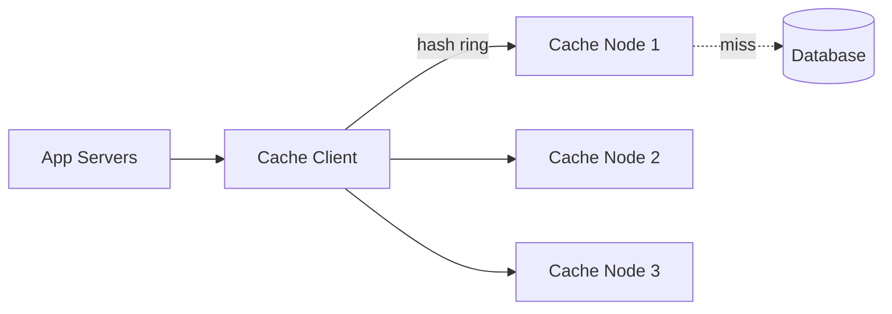
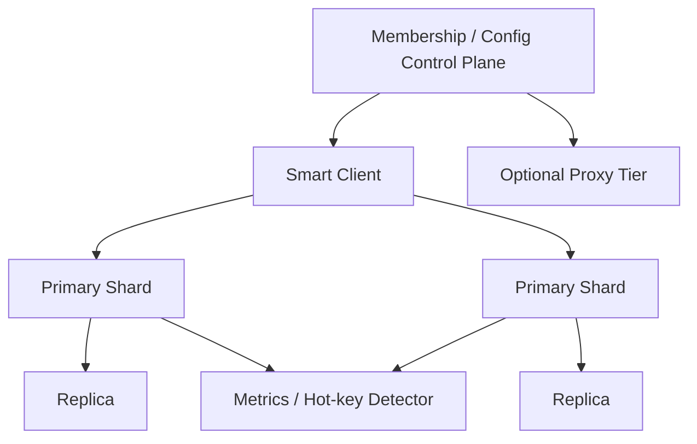

# ⚡ Design a Distributed Cache

> A fast, shared, in-memory key-value layer in front of your database — the idea behind Redis and Memcached.

---

## 🎯 The Problem

Databases are relatively slow and expensive to query. A **distributed cache** keeps frequently-accessed data in memory across a cluster of machines, so reads return in **sub-milliseconds** and the database is spared. The challenges: spreading data across nodes, surviving node failures, and deciding what to evict when memory fills up.

---

## 📝 Requirements

**Functional**
- `get(key)`, `put(key, value)`, `delete(key)`, with optional TTL (expiry).
- Distributed across many nodes; scales horizontally.

**Non-functional**
- **Sub-millisecond** reads and writes.
- **Highly available** — surviving node failures without losing the whole cache.
- Even load distribution across nodes.

---

## 🏗️ High-Level Architecture



The cache is a **cluster of nodes**, each holding a slice of the data in memory. A smart **client** uses **consistent hashing** to decide which node owns a given key, then reads/writes there. On a cache miss, the app loads from the database and populates the cache.

---

## 🔄 Consistent Hashing

The naive approach — `hash(key) % N` — breaks badly when you add or remove a node: almost every key remaps to a different node, causing a storm of cache misses.

**Consistent hashing** places both nodes and keys on a conceptual **ring**. A key belongs to the next node clockwise. When a node is added or removed, only the keys *near it* move — everything else stays put. Adding **virtual nodes** (each physical node appears at many ring positions) keeps the load evenly balanced.

---

## 🧹 Eviction & Write Strategies

When memory is full, the cache must **evict** something:

- **LRU (Least Recently Used)** — evict what hasn't been touched longest. Most common.
- **LFU (Least Frequently Used)** — evict the least-accessed items.
- **TTL** — items expire after a set time.

**Write strategies** decide how the cache and DB stay in sync:

| Strategy | Behavior |
| --- | --- |
| **Cache-aside** | App checks cache; on miss, loads DB and fills cache (most common) |
| **Write-through** | Writes go to cache **and** DB synchronously (consistent, slower writes) |
| **Write-back** | Write to cache, flush to DB asynchronously (fast, risk of loss on crash) |

---

## 🗄️ Data Model (per node)

| Field | Notes |
| --- | --- |
| `key` | Hashed to locate the owning node |
| `value` | Serialized bytes |
| `ttl` | Expiry time |

Conceptually, each node stores entries in a hash table with expiry and eviction metadata. A textbook cache can use an exact LRU list, while production systems such as Redis often use an **approximation** to reduce memory and CPU overhead.

---

## ⚖️ Deep Dives & Trade-offs

**Replication** — copy each key to one or more replica nodes so a node failure doesn't lose data or create a flood of misses.

**Hot keys** — one extremely popular key can overload its single node. Mitigate by replicating hot keys or adding a small local (client-side) cache.

**Consistency** — a cache can serve stale data. Use TTLs and invalidate/update entries on writes; most systems accept brief staleness for the huge speed gain.

---

## 🧭 Scope, guarantees & workload model

This design is for a volatile distributed key-value cache used in front of a durable source. It supports `GET`, `MGET`, `SET`, `DELETE`, TTL, compare-and-set, and optional replication. It is not automatically a database: write-back durability requires a separate, much stricter design.

Define the contract before the cluster:

- Values are opaque bounded byte arrays; serialization/versioning belongs to the caller contract.
- Expiration is best-effort around the TTL boundary; callers must tolerate a missing key at any time.
- Eviction is normal behavior, not an error.
- A successful replicated write means the selected acknowledgement policy was met—not necessarily disk durability.
- The cache must never make unauthorized data visible across tenants.

Example: 10 million keys averaging 2 KB value + 300 bytes overhead requires ≈ 23 GB primary memory. With replication factor 2, fragmentation, rebalancing reserve, and 30% headroom, plan roughly 65–75 GB across nodes. At 200,000 operations/sec with 90% reads, size network, CPU, and connection pools for peak plus node-loss redistribution.

---

## 📜 Protocol contract

```text
GET key                         -> HIT(version, value, ttlRemaining) | MISS
SET key value ttl [IF_ABSENT]   -> STORED(version) | EXISTS
CAS key expectedVersion value   -> STORED(newVersion) | CONFLICT | MISS
DELETE key [expectedVersion]    -> DELETED | CONFLICT | MISS
```

Reject oversized keys/values early. Give every operation a timeout shorter than the caller’s database budget. Batch only keys that map to compatible shards or let the client split/merge requests. Never expose raw backend topology to untrusted clients.

---

## 🧩 Control plane and data plane



The control plane owns node identity, health, slot/ring assignment, configuration version, and safe rebalancing. The data plane serves key operations. Keep the last-known-good membership map on clients; a temporary control-plane outage should not immediately stop cache traffic.

Use virtual nodes or fixed hash slots to distribute ownership. Fixed slots simplify resharding and operational tooling; pure consistent hashing minimizes remapping. Replicas should live on different failure domains.

---

## 🔄 Read, write and invalidation flows

**Cache-aside read**

1. Derive a namespaced, versioned cache key.
2. Read cache with a tight timeout. On hit, validate schema/version and return.
3. On miss, read the authoritative database.
4. Coalesce concurrent misses for the same key (“single flight”) and populate with TTL + jitter.

**Write with cache invalidation**

1. Commit the authoritative database transaction.
2. Publish an outbox/change-data-capture invalidation carrying entity version.
3. Delete/update cache. Consumers ignore older invalidations.
4. Use TTL as the final repair mechanism, not the only correctness mechanism.

**Rebalancing**

1. Add a node as a replica/target, copy assigned slots while normal traffic continues.
2. Replay changes or dual-write for a bounded window.
3. Atomically publish a newer routing version.
4. Drain old ownership after clients converge; retain redirects briefly.

---

## 🧯 Stampedes, hot keys & failure matrix

- **Stampede:** single-flight loads, probabilistic early refresh, staggered TTLs, and stale-while-revalidate for data where bounded staleness is safe.
- **Penetration:** negative-cache known misses briefly; combine with Bloom filters only where false positives/negatives are understood.
- **Hot keys:** detect skew, replicate read-only hot values, use near-cache, or deliberately shard a counter. More cluster nodes do not help if one key has one owner.
- **Large keys:** cap item size and watch network/allocator pressure; store blobs in object storage.

| Failure | Behavior |
| --- | --- |
| Primary node dies | Promote a sufficiently current replica; clients refresh topology and retry once |
| Network partition | Choose availability or write safety explicitly; reject unsafe minority writes for CAS/locks |
| Cache cluster unavailable | Circuit-break to the database with strict load shedding; never create a DB stampede |
| Eviction spike | Continue serving misses; alert on hit-ratio and latency degradation |
| Serialization mismatch | Treat as miss, record metric, and repopulate under the new key version |
| Rebalance overload | Pause migration before customer traffic saturates |

---

## 🔐 Security & isolation

- Authenticate clients with short-lived workload identity, authorize key prefixes/commands, use TLS, and bind administrative interfaces privately.
- Namespace keys by environment and tenant, but avoid raw personal data in keys because keys appear in logs, metrics, and memory dumps.
- Store credentials outside config files/source. Disable dangerous administrative commands for application identities.
- Encrypt sensitive values before caching where threat modeling requires it; understand that in-memory data and replicas still expand exposure.
- Rate-limit connections/operations, cap memory per tenant, and prevent one noisy tenant from exhausting the cluster.

---

## 📈 Operations, alternatives & rollout

Monitor hit ratio by workload, latency percentiles, evictions/expirations, memory fragmentation, CPU, network, connections, replication lag, failovers, hot-key concentration, error/timeouts, database fallback QPS, and rebalance progress. Test node loss at peak, not only in an empty staging cluster.

Use a local in-process cache when values are tiny and staleness is acceptable; use a proxy when client simplicity matters; use a smart client for one less network hop; use a managed cache when the team cannot safely operate failover and resharding. The decision is operational as much as algorithmic.

### 60-second interview summary

“I define a volatile cache contract, partition keys with hash slots/consistent hashing, replicate across failure domains, and keep routing in a separate control plane. Cache-aside reads use single-flight and jitter; writes commit to the database then publish versioned invalidations. I design for stampedes, hot keys, node loss, and database protection, and monitor hit ratio together with fallback load.”

### Further reading

- [Redis key eviction policies and approximate LRU](https://redis.io/docs/latest/develop/reference/eviction/)
- [Redis Cluster specification](https://redis.io/docs/latest/operate/oss_and_stack/reference/cluster-spec/)
- [DynamoDB partition-key design](https://docs.aws.amazon.com/amazondynamodb/latest/developerguide/bp-partition-key-design.html)

---

## ❓ FAQs

### What happens on a cache miss?
The app reads the value from the database, stores it in the cache for next time, and returns it. This is the cache-aside pattern.

### Why is consistent hashing better than `hash(key) % N`?
With modulo hashing, changing the number of nodes remaps nearly every key, causing massive cache misses. Consistent hashing only moves the keys near the added/removed node, so the rest of the cache stays warm.

### How do you keep the cache from serving stale data?
Set TTLs so entries expire, and invalidate or update cache entries when the underlying data changes. Most systems tolerate brief staleness in exchange for speed.

### How do you handle a single extremely popular ("hot") key?
Replicate that key across multiple nodes to spread the load, and/or add a small local cache on the app servers so requests don't all hit one node.
