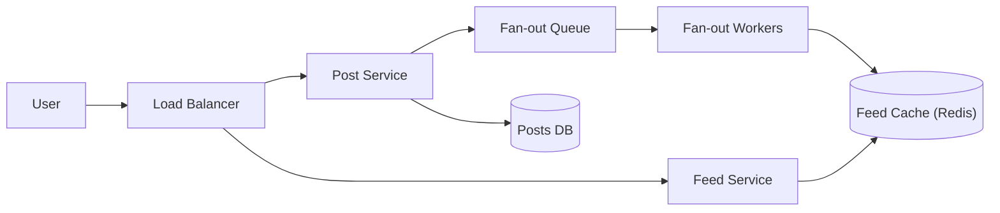

# 📰 Design a News Feed / Timeline

> Show each user a personalized, ranked stream of posts from people they follow — the core of Twitter, Instagram, and Facebook.

---

## 🎯 The Problem

When you open Twitter or Instagram, you instantly see recent posts from everyone you follow. Behind that simple scroll is a hard problem: a user may follow thousands of people, each posting constantly, and the feed must load in **milliseconds**. The central design question is *when* to build each feed — at write time or read time.

---

## 📝 Requirements

**Functional**
- Users can follow/unfollow other users.
- Users can publish posts (text, images).
- A user's feed shows recent posts from the people they follow, newest/most-relevant first.

**Non-functional**
- Feed must load very fast (< 200 ms) — the system is **extremely read-heavy**.
- Near-real-time: a new post should appear within seconds.
- **Eventual consistency** is acceptable — a slight delay is fine.

**Scale**
- Hundreds of millions of users; a "celebrity" may have tens of millions of followers.

---

## 🏗️ High-Level Architecture



Posting and reading are separated. The **Post Service** saves the post and drops a job on a **fan-out queue**. **Workers** then update the precomputed feeds of the author's followers in a **Redis feed cache**. Reading a feed is then just a fast lookup in that cache.

---

## 🌪️ The Core Decision: Fan-out

The key trade-off is *when* to assemble a feed.

**Fan-out on write (push)** — when a user posts, immediately push the post's ID into every follower's precomputed feed list.
- ✅ Feeds load instantly (just read the list).
- ❌ Expensive when a celebrity with millions of followers posts (millions of writes).

**Fan-out on read (pull)** — build the feed on demand by fetching and merging recent posts from everyone the user follows.
- ✅ Cheap writes.
- ❌ Slow reads for users who follow many people.

**Hybrid (the real answer):** use **push** for normal users, but for **celebrities**, *don't* fan out. Instead, **pull** their recent posts at read time and merge them into the feed. This avoids the "celebrity problem" while keeping most reads fast.

---

## 🗄️ Data Model

**posts**

| Column | Type |
| --- | --- |
| `post_id` | BIGINT PK |
| `user_id` | BIGINT |
| `content` | TEXT |
| `created_at` | TIMESTAMP |

**follows**

| Column | Type |
| --- | --- |
| `follower_id` | BIGINT |
| `followee_id` | BIGINT |

**Feed cache (Redis):** `feed:{userId}` → an ordered list of the latest `post_id`s.

---

## ⚖️ Deep Dives & Trade-offs

**Store IDs, not content** — the feed cache holds only post IDs. The actual post content is fetched (from cache/DB) when rendering. This keeps the feed cache small.

**Ranking** — beyond pure recency, a ranking service can score posts by engagement, relationship strength, and relevance (this is what turns a "timeline" into an "algorithmic feed").

**Bounding memory** — cap each cached feed (e.g., the latest 800 posts). Older posts are fetched on demand if the user scrolls far.

**Consistency** — feeds are eventually consistent. Define a measurable freshness target; for example, 99% of eligible non-celebrity posts appear within a few seconds. The author’s own successful post should be read-your-writes consistent.

---

## 🧭 Scope, invariants & capacity

This design covers publishing, follow relationships, home-feed candidate generation, ranking, pagination, deletes, and privacy changes. Recommendations, ads auctions, media transformation, and moderation models are dependencies with separate designs.

**Invariants**

- A viewer sees only posts they are authorized to view **at read time**.
- A create acknowledged to the author is durable and appears in the author’s profile immediately.
- Feed entries are references/candidates, not authorization decisions or canonical post content.
- Pagination is stable enough not to repeat endlessly or skip large ranges while ranking changes.
- Deletes/privacy blocks propagate with a stricter SLO than ordinary feed freshness.

Example: 100 million daily users opening a feed 10 times/day produces 1 billion feed reads/day, ≈ 11,600/sec average and perhaps 10× peak. If 20 million users create two posts/day, writes average ≈ 460/sec, but fan-out can create orders of magnitude more internal writes. A cached feed holding 800 IDs × 16 bytes plus metadata is roughly 15–25 KB/user; for 50 million active cached users that is near 1 TB before replicas/overhead.

---

## 📜 APIs and pagination

```http
POST /v1/posts
Idempotency-Key: <uuid>
{"text":"...","mediaIds":["m-1"],"audience":"FOLLOWERS"}

GET /v1/feed?cursor=<opaque>&limit=30
```

```json
{
  "items": [{"postId":"p-91","authorId":"u-7","rankReason":"RECENT"}],
  "nextCursor": "opaque-signed-token",
  "generatedAt": "2026-08-08T10:20:00Z"
}
```

The cursor should carry a signed snapshot/ranking version and last sort tuple, not a client-editable offset. Cap page size and avoid returning internal model features. Post creation is idempotent; follow/unfollow and delete endpoints are naturally idempotent state assignments.

---

## 🗃️ Storage by access pattern

| Store | Primary access pattern |
| --- | --- |
| Post store | Point read by post ID; recent posts by author |
| Social graph | Followees by follower; followers by author, both paginated |
| Feed candidate store | Ordered candidate IDs/scores by viewer |
| Object storage/CDN | Media bytes and renditions |
| Feature store | Bounded-latency ranking features |
| Event log | Durable post/follow/delete/moderation changes |

Partition author timelines by `(authorId, timeBucket)` and feed inboxes by viewer. For celebrity follower lists, shard by follower ID/range. Avoid copying full post bodies into millions of feed records; hydration fetches canonical content in batches through cache.

---

## 🔄 Write, read and delete flows

**Publish**

1. Authenticate, validate content/media ownership and audience, then deduplicate the request.
2. Store the post and an outbox `PostCreated` event in one transaction.
3. Update the author timeline immediately.
4. Fan-out workers page followers, filter obvious ineligible relationships, and insert a bounded candidate reference idempotently.
5. Skip write fan-out for high-fanout authors; mark them as pull sources.

**Read**

1. Load the viewer’s precomputed candidates plus recent candidates from pull/celebrity sources.
2. Deduplicate, remove expired candidates, and batch-hydrate post/author data.
3. Recheck blocks, privacy, deletions, moderation, and geography/age policy at read time.
4. Rank within a strict latency budget; fall back to chronological order if feature/model services fail.
5. Return a signed cursor and asynchronously record privacy-safe impressions.

**Delete/block/privacy change**

1. Change canonical authorization state first and emit a high-priority invalidation event.
2. Read-time filtering hides content immediately even if stale IDs remain in inboxes.
3. Background workers remove stale candidates and invalidate caches.

---

## 🧠 Ranking without losing reliability

Use a two-stage pipeline: cheap candidate generation yields hundreds/thousands of IDs; a bounded ranking service scores a much smaller set. Features must have defaults and freshness metadata. Pin model/config versions per response for debugging.

Ranking is not allowed to bypass policy filters. Apply hard eligibility both before and after ranking, since cached candidates and features can be stale. Keep a chronological fallback so a model outage does not become a feed outage.

---

## 🧯 Failure, replay & consistency

| Scenario | Safe behavior |
| --- | --- |
| Fan-out event repeats | Unique `(viewerId, postId)` or idempotent sorted-set update |
| Worker crashes mid follower page | Resume from checkpoint; duplicates are harmless |
| Feed cache missing | Rebuild bounded recent candidates from author timelines; shed deep pagination |
| Ranking times out | Return eligible chronological candidates |
| Celebrity post spikes reads | Cache author timeline and hydrated post; protect origin with request coalescing |
| Unfollow/block races with fan-out | Read-time relationship check removes stale candidate |
| Event backlog grows | Prioritize delete/privacy events; surface feed freshness degradation |

The design provides read-your-writes for the author and eventual inclusion for followers. It does not provide a frozen global ordering: new posts, deletes, and model changes naturally alter later pages.

---

## 🔐 Privacy, abuse & operations

- Enforce audience, block, mute, and legal restrictions server-side on every hydration/read. A feed cache is never an authorization cache.
- Use short-lived media URLs, encrypt sensitive stores, and keep service credentials in managed secret storage.
- Minimize and retain impression/feature data according to policy; never log post bodies or sensitive model features by default.
- Rate-limit posting/follow changes, detect graph abuse, cap fan-out per event, and isolate abusive/high-fanout accounts.
- Monitor publish success, fan-out lag/completion, feed latency, candidate count, cache hit ratio, hydration misses, ranking timeout/fallback, privacy-filter rate, duplicate rate, and delete propagation latency.

Roll out ranking in shadow mode, compare against a chronological baseline, canary by cohort, and keep model/config rollback independent. Load-test celebrity posts and follower-page retries explicitly.

### 60-second interview summary

“I store posts canonically and build feeds with hybrid fan-out: push IDs for normal authors and pull high-fanout authors at read time. Reads merge, deduplicate, re-authorize, hydrate, then rank within a latency budget with chronological fallback. Outbox events make fan-out recoverable, candidate updates are idempotent, and privacy/delete checks happen at read time so stale inbox IDs cannot leak content.”

### Further reading

- [Apache Kafka ordering and replicated event logs](https://kafka.apache.org/documentation/)
- [Facebook TAO social-graph research](https://research.facebook.com/publications/tao-facebooks-distributed-data-store-for-the-social-graph/)
- [DynamoDB write sharding](https://docs.aws.amazon.com/amazondynamodb/latest/developerguide/bp-partition-key-sharding.html)

---

## ❓ FAQs

### Why not just query the database every time the feed loads?
A user following thousands of accounts would trigger a huge multi-way merge on every refresh — far too slow at scale. Precomputing feeds with fan-out turns the read into a single fast lookup.

### What is the "celebrity problem" and how do you solve it?
When someone with millions of followers posts, fan-out-on-write would create millions of feed updates instantly. The fix is a hybrid: skip fan-out for celebrities and instead pull their posts in at read time and merge them.

### Is the feed strongly consistent?
No, and it doesn't need to be. Eventual consistency is acceptable — nobody notices if a post appears one second late.

### Why store only post IDs in the feed cache?
To save memory. Full post content is large and may change (edits, deletions); storing IDs keeps feeds compact and lets you fetch the latest content at render time.
