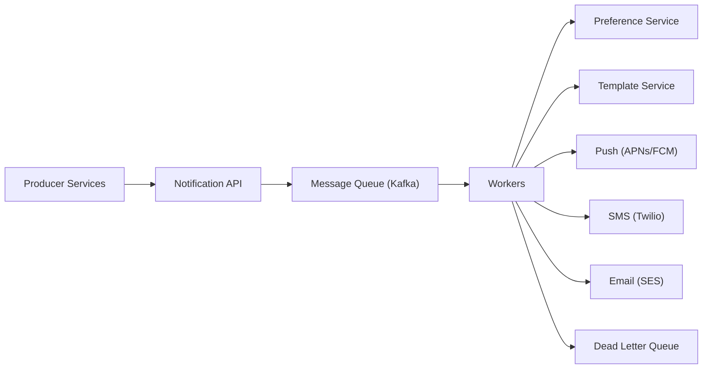

# 🔔 Design a Notification System

> Deliver push, SMS, and email notifications reliably at scale, respecting user preferences.

---

## 🎯 The Problem

Almost every app sends notifications: an OTP over SMS, a "your order shipped" email, a push alert for a new message. A **notification system** is the shared service that takes a request from any team and reliably delivers it over the right channel — handling templates, user preferences, retries, and huge volume.

---

## 📝 Requirements

**Functional**
- Send notifications across multiple channels: **push, SMS, email**.
- Respect user preferences and opt-outs per channel.
- Support templates, scheduling, and retries.

**Non-functional**
- **Reliable** — at-least-once delivery; nothing silently dropped.
- Scalable to millions of notifications; low latency for urgent ones (OTPs).
- Resilient to third-party (Twilio, APNs) outages.

---

## 🏗️ High-Level Architecture



Producers just publish a notification request to the **API**, which puts it on a **queue**. **Workers** consume events, check the user's **preferences**, render a **template**, and call the right third-party gateway. Anything that repeatedly fails goes to a **dead-letter queue** for later retry or inspection.

---

## 🧩 Why a Queue in the Middle?

The queue is the backbone. It:

- **Decouples** producers from delivery — a service fires a request and moves on.
- **Absorbs spikes** — a sudden burst (e.g., a marketing blast) is buffered, not dropped.
- **Enables retries** — if a gateway is temporarily down, the worker retries with backoff.
- **Isolates failures** — a slow email provider doesn't block push notifications.

---

## 🗄️ Data Model

**notifications**

| Column | Type |
| --- | --- |
| `id` | UUID PK |
| `user_id` | BIGINT |
| `channel` | ENUM (PUSH / SMS / EMAIL) |
| `template_id` | VARCHAR |
| `status` | ENUM (QUEUED / SENT / FAILED) |
| `created_at` | TIMESTAMP |

**user_preferences**

| Column | Type |
| --- | --- |
| `user_id` | BIGINT |
| `channel` | ENUM |
| `enabled` | BOOLEAN |

---

## ⚖️ Deep Dives & Trade-offs

**Idempotency** — networks retry, so a request could arrive twice. Attach an **idempotency key** and store processed keys, so a retry never double-sends.

**Priority queues** — a login OTP must beat a marketing newsletter. Use separate high/low priority queues so urgent notifications jump ahead.

**Rate limiting** — third parties (Twilio, APNs) enforce their own limits. Workers must throttle to stay within them and back off on `429`s.

**Retries & DLQ** — retry transient failures with exponential backoff. After N attempts, move the message to a dead-letter queue and optionally fall back to another channel.

---

## 🧭 Scope, delivery semantics & sizing

This service accepts transactional and bulk notification intents, resolves recipients/preferences/templates, and attempts delivery through email, SMS, and push providers. It does not guarantee that a human saw a message: providers and devices expose different acceptance, delivery, and engagement signals.

Use precise states:

```text
ACCEPTED → SUPPRESSED
         → SCHEDULED → QUEUED → PROVIDER_ACCEPTED → DELIVERED
                                      └──────────→ BOUNCED | FAILED | UNKNOWN
```

The realistic guarantee is **at-least-once processing with an idempotent send effect where the provider supports it**. A provider timeout can leave the outcome unknown, so “exactly once delivered” cannot be promised.

Example assumptions: 50 million notification requests/day is ≈ 580/sec average. At a 10× campaign peak, provision for ≈ 6,000/sec. If each internal event averages 1 KB and is retained for three days, the queue needs ≈ 150 GB raw plus replication. Split OTP/transactional/bulk workloads because their latency and retry budgets are fundamentally different.

---

## 📜 Request contract

```http
POST /v1/notifications
Authorization: Bearer <service-token>
Idempotency-Key: order-8347-shipped-v1
Content-Type: application/json

{
  "recipientId": "user-1842",
  "purpose": "ORDER_UPDATE",
  "templateId": "order-shipped",
  "templateVersion": 7,
  "channels": ["PUSH", "EMAIL"],
  "priority": "TRANSACTIONAL",
  "variables": {"orderNumber":"8347"},
  "scheduleAt": null,
  "expiresAt": "2026-08-09T12:00:00Z"
}
```

Return `202 Accepted` with a stable `notificationId`; producers query status separately or consume result events. Validate purpose, recipient, template variable schema, scheduling range, payload size, and producer authorization. Producers must not supply arbitrary HTML, phone numbers, device tokens, or provider credentials unless their contract explicitly allows it.

---

## 🗃️ Data model & source-of-truth boundaries

| Record | Important fields | Source of truth for |
| --- | --- | --- |
| `notification` | id, producer, recipient, purpose, priority, state, expires_at | Overall intent and lifecycle |
| `delivery_attempt` | notification_id, channel, provider, attempt_no, request_ref, outcome, error_code | Immutable provider attempt history |
| `preference` | recipient, purpose, channel, enabled, legal_basis, version | Opt-in/opt-out decision |
| `endpoint` | recipient, channel, encrypted address/token, status, last_verified | Where delivery is attempted |
| `template_version` | template_id, version, locale, variable_schema, content_ref, approved_at | Reproducible rendered content |
| `idempotency` | producer, key, request_hash, response, expires_at | Stable retry result |

Store the template **version and rendered-content hash** on the notification. A retry should not silently pick up a newly edited template. Encrypt endpoints, minimize retention, and never include OTP values or message bodies in logs.

---

## 🔄 End-to-end lifecycle

**Accept and enqueue**

1. Authenticate the producer and authorize the requested purpose/priority.
2. Validate and claim `(producerId, idempotencyKey)`. A reused key with different payload returns `409`.
3. Write the notification and an outbox event in one database transaction.
4. An outbox publisher places the event on the correct workload/channel topic. Return `202` after durable acceptance—not after provider delivery.

**Resolve and send**

1. Consumer checks expiry and terminal state.
2. Resolve the current legal/preference decision. Critical security notifications should use a separately defined policy, not silently bypass generic opt-outs.
3. Resolve verified endpoints and the pinned template version; render with escaped, schema-validated variables.
4. Claim a channel attempt with a unique key such as `(notificationId, channel, endpointVersion)`.
5. Apply provider and recipient rate limits, then call the provider with a bounded timeout.
6. Persist the provider request ID/outcome before acknowledging the queue message.

**Callbacks and reconciliation**

1. Verify webhook signatures and freshness; store the raw event securely for replay.
2. Deduplicate by provider event ID and apply only valid state transitions.
3. Periodically reconcile old `UNKNOWN`/`PROVIDER_ACCEPTED` attempts against provider APIs where available.

---

## ⏱️ Priority, retries & backpressure

Use separate queues and worker pools for `OTP`, `TRANSACTIONAL`, and `BULK`; one priority field inside a single FIFO queue can still let a huge batch occupy all workers. Define per-class budgets:

| Class | Queue target | Expiry | Retry example | Fallback |
| --- | ---: | ---: | --- | --- |
| OTP | p99 < 2 sec | 5 min | short jittered retries | alternate verified channel only if policy permits |
| Transactional | p99 < 30 sec | hours/days | exponential backoff + jitter | configured per purpose |
| Bulk | minutes | campaign window | slow retry, aggressive throttling | usually none |

Retry only transient failures (`429`, timeouts, selected `5xx`). Permanent errors—invalid address, unsubscribed, malformed payload—go directly to a terminal state. Cap attempts and elapsed retry time; a DLQ is an investigation/replay tool, not an infinite retry loop.

---

## 🧯 Failure, consistency & replay matrix

| Scenario | Behavior |
| --- | --- |
| API commits but publish fails | Outbox publisher retries; intent is not lost |
| Worker crashes after provider accepted | Message is redelivered; attempt key/provider idempotency prevents an avoidable duplicate |
| Provider times out | Mark `UNKNOWN`; reconcile before retrying when the channel is duplicate-sensitive |
| Preference service unavailable | Fail closed for marketing; use last-known legally valid policy only where explicitly approved |
| Template service unavailable | Use pinned cached version; never invent content |
| Provider outage | Circuit-break, slow retries, drain alternate provider only when routing policy allows |
| Poison message | Quarantine in DLQ with redacted diagnostic context and controlled replay |

Provider acceptance is not device delivery. APNs, for example, is best-effort and may coalesce stored notifications. Model channel-specific semantics rather than forcing every provider into a misleading universal `SENT` state.

---

## 🔐 Security, privacy & compliance

- Use mTLS or short-lived workload identities between producers and the API; authorize allowed purposes, templates, channels, and priorities.
- Keep provider keys in a secrets manager/KMS, rotate them, and never expose them to producer services or client applications.
- Verify webhook signatures against the raw request body and defend against replay. Encrypt recipient endpoints at rest.
- Treat preferences as compliance records: record version, source, timestamp, jurisdiction/legal basis, and deletion/retention rules.
- Prevent template injection by schema-validating variables and context-escaping HTML, URLs, and headers. Disallow arbitrary sender/header fields to prevent spoofing and header injection.
- Redact phone numbers, emails, device tokens, OTPs, reset links, and template variables from logs/traces.

---

## 📈 Observability, SLOs & rollout

Measure acceptance rate/latency, queue age by class, end-to-end delivery latency, provider acceptance/error codes, retry and suppression rates, preference staleness, endpoint invalidation, DLQ depth, callback lag, and cost per channel. Use a correlation ID from producer → notification → attempt → provider callback.

Before launch, shadow preference decisions, canary one producer/channel, inject provider timeouts, test worker crashes between send and acknowledgement, prove DLQ redrive is idempotent, and document who may replay a message. Roll back routing/templates independently from code.

### 60-second interview summary

“The API durably records a versioned notification intent and publishes it through an outbox. Separate queues isolate OTP, transactional, and bulk traffic. Workers check legally auditable preferences, render a pinned template, claim an idempotent attempt, and call channel adapters with rate limits and bounded retries. Provider callbacks are verified and deduplicated; unknown outcomes are reconciled. I monitor queue age and end-to-end delivery, not just API success.”

### Further reading

- [Amazon SQS visibility timeouts and at-least-once processing](https://docs.aws.amazon.com/AWSSimpleQueueService/latest/SQSDeveloperGuide/sqs-visibility-timeout.html)
- [Amazon SQS dead-letter queues](https://docs.aws.amazon.com/AWSSimpleQueueService/latest/SQSDeveloperGuide/sqs-dead-letter-queues.html)
- [Apple: setting up an APNs provider server](https://developer.apple.com/documentation/usernotifications/setting-up-a-remote-notification-server)

---

## ❓ FAQs

### How do you make sure a user isn't notified twice for the same event?
Use idempotency keys. Each request carries a unique key; the system records processed keys and skips any duplicate, so retries or double-publishes don't cause double sends.

### What happens if a provider like Twilio is temporarily down?
The worker retries with exponential backoff. If it keeps failing, the message moves to a dead-letter queue for later processing, and you can optionally fall back to a different channel.

### How do you ensure urgent notifications (like OTPs) aren't stuck behind bulk sends?
Use priority queues. OTPs and other time-sensitive messages go on a high-priority queue that workers drain first, ahead of marketing traffic.

### How does the system respect user opt-outs?
Before sending, the worker checks the preference service for that user and channel. If notifications are disabled, the message is dropped instead of delivered.
