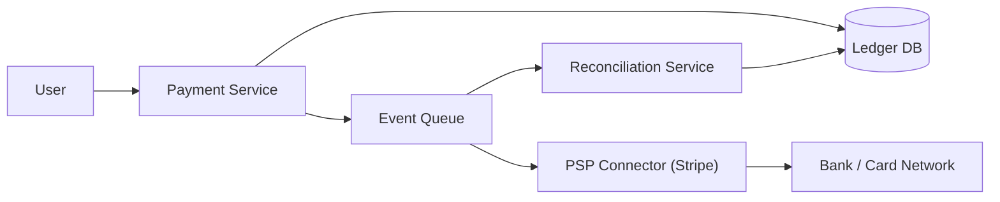

# 💳 Design a Payment System

> Move money reliably — with no lost, duplicate, or inconsistent transactions. Correctness matters more than speed here.

---

## 🎯 The Problem

A **payment system** charges customers, pays merchants, and handles refunds — integrating with banks and card networks. Unlike most systems, the top priority isn't speed or scale but **correctness**: money must never be lost, double-charged, or left in an inconsistent state. Every action must be auditable.

---

## 📝 Requirements

**Functional**
- Charge a customer, pay out to a merchant, process refunds.
- Integrate with external payment gateways (Stripe, banks).
- Keep a complete, auditable history.

**Non-functional**
- **Correctness above all** — an exactly-once *business effect* built from idempotency, strongly consistent state, and reconciliation; networks and queues can still deliver more than once.
- Highly available and secure (**PCI compliance**).
- Reconcilable against external providers.

---

## 🏗️ High-Level Architecture



The **Payment Service** records every transaction in a **ledger** and puts the actual money movement on a **queue**. A **PSP connector** talks to the external processor (Stripe/bank). A **reconciliation service** periodically compares your ledger against the provider to catch any discrepancy.

---

## 📒 The Ledger & Double-Entry Bookkeeping

Money is tracked in an **append-only ledger** — you never edit or delete a balance, only add new entries. It uses **double-entry bookkeeping**: every transaction creates **two balanced entries**, a debit from one account and a credit to another, that always sum to zero.

Balances are *derived* by summing the ledger, never stored and mutated directly. This makes the system **self-auditing**: if debits and credits don't balance, you know something is wrong.

---

## 🔁 Idempotency & Exactly-Once

Networks are unreliable and clients retry. Without protection, a retry could **charge a customer twice**. The solution: every payment request carries an **idempotency key**. The service records each key and its result; if the same key arrives again, it returns the original result instead of charging again.

Because true distributed transactions (2-phase commit) are slow and fragile, cross-service flows use the **Saga pattern** — a sequence of local transactions, each with a compensating action to undo it if a later step fails.

---

## 🗄️ Data Model

**transactions**

| Column | Type |
| --- | --- |
| `txn_id` | UUID PK |
| `idempotency_key` | VARCHAR UNIQUE |
| `payer_id`, `payee_id` | BIGINT |
| `amount` | DECIMAL |
| `currency` | CHAR(3) |
| `status` | ENUM (PENDING / SUCCESS / FAILED / REFUNDED) |

**ledger_entries**

| Column | Type |
| --- | --- |
| `entry_id` | UUID PK |
| `txn_id` | UUID |
| `account_id` | BIGINT |
| `direction` | ENUM (DEBIT / CREDIT) |
| `amount` | DECIMAL |

Use a **strongly consistent, ACID** relational database — money cannot tolerate eventual consistency.

---

## ⚖️ Deep Dives & Trade-offs

**Reconciliation** — regularly compare your ledger against the PSP/bank statements to catch mismatches (a charge that succeeded externally but wasn't recorded, etc.).

**Async settlement** — the external bank call is slow and may take seconds. Queue it, mark the transaction `PENDING`, and update to `SUCCESS`/`FAILED` when the provider's **webhook** confirms.

**Security** — never store raw card numbers. Tokenize them via the PSP so sensitive data never touches your servers (PCI scope reduction).

---

## 🧭 Scope, invariants & assumptions

This design covers one-time purchase authorization/capture, merchant balance accounting, refunds, provider webhooks, reconciliation, and audit. Card vaulting, fraud models, disputes/chargebacks, payout rails, tax, and FX are named dependencies.

**Non-negotiable invariants**

- Monetary amounts use integer minor units or fixed-precision decimal plus ISO currency; never binary floating point.
- Every posted ledger transaction balances: total debits equal total credits per currency.
- Ledger entries are immutable. Corrections are new reversing/adjusting entries.
- One merchant/order operation has one stable idempotency key and immutable request fingerprint.
- External provider state and internal state can temporarily diverge, but every divergence is discoverable and reconcilable.
- A status transition is monotonic and validated; late webhooks cannot turn `REFUNDED` back into `CAPTURED`.

Example: 10 million payments/day is ≈ 116/sec average; plan 10× peak plus provider latency. If each payment creates 4 ledger lines and each line/index footprint is ≈ 500 bytes, primary ledger growth is ≈ 20 GB/day before replicas and audit retention. Accuracy, auditability, and recovery time drive this design more than raw QPS.

---

## 📜 API and state machine

```http
POST /v1/payment-intents
Idempotency-Key: merchant-92:order-771:attempt-1
Authorization: Bearer <token>

{"merchantId":"m-92","orderId":"o-771","amount":2599,
 "currency":"USD","paymentMethodToken":"pm_tok_...","captureMode":"AUTOMATIC"}
```

```text
CREATED → REQUIRES_ACTION → PROCESSING → AUTHORIZED → CAPTURED
   └───────────────────────────────→ FAILED | CANCELLED
CAPTURED → PARTIALLY_REFUNDED → REFUNDED
```

Return a stable payment intent even while processing. A client timeout is not proof of failure; clients retrieve the intent by ID/idempotency key instead of creating a new attempt. Reject reuse of an idempotency key with a different canonical request hash.

---

## 🗃️ Data model and ledger postings

| Record | Important fields |
| --- | --- |
| `payment_intent` | id, merchant/order, amount, currency, state, version, idempotency key/hash |
| `provider_attempt` | intent_id, attempt_no, provider, provider_ref, state, request/response hash |
| `ledger_transaction` | id, type, effective_at, correlation_id, reversal_of |
| `ledger_entry` | transaction_id, account_id, currency, amount_minor, direction |
| `outbox_event` | aggregate_id, sequence, type, payload_version, published_at |
| `provider_event` | provider_event_id unique, received_at, signature_status, processed_at |

Example capture of $25.99 before fees:

| Account | Debit | Credit |
| --- | ---: | ---: |
| Processor clearing receivable | $25.99 | — |
| Merchant pending payable | — | $25.99 |

Provider fees and settlement create separate balanced transactions. Do not mutate a cached balance inside the same conceptual row as history; maintain an immutable journal and an asynchronously/transactionally updated balance projection that can be rebuilt.

---

## 🔄 End-to-end flows

**Create and process**

1. Authenticate merchant; validate currency, positive amount, order ownership, token format, and limits.
2. In one ACID transaction, claim idempotency, create intent `CREATED`, and add an outbox event.
3. A connector claims the attempt and calls the PSP with the same stable provider idempotency key and a bounded timeout.
4. Persist provider reference and outcome. If confirmation is needed, return `REQUIRES_ACTION`; otherwise advance through `AUTHORIZED/CAPTURED`.
5. Post balanced ledger entries in the same transaction as the internal capture transition.
6. Publish versioned domain events from the outbox.

**Webhook**

1. Verify TLS and provider signature against the exact raw body; reject stale/replayed signatures.
2. Deduplicate provider event ID, resolve the attempt, and lock/version-check the intent.
3. Apply only a legal transition, post ledger effects if needed, and mark the event processed atomically.
4. Return quickly; queue slow follow-up work.

**Refund**

Validate refundable remaining amount, create an idempotent refund entity, call the PSP asynchronously, and post reversing ledger entries only for confirmed amounts. Multiple partial refunds must be serialized or protected by a constraint so their sum cannot exceed captured value.

---

## 🧯 Unknown outcomes, retries & reconciliation

| Scenario | Behavior |
| --- | --- |
| PSP times out after request | Mark attempt `UNKNOWN`; query by provider idempotency key/reference before retry |
| API process crashes after DB commit | Outbox resumes connector work |
| Webhook arrives twice/out of order | Dedup event ID; state-machine/version checks ignore stale effect |
| Ledger post fails | Roll back internal state transition; never expose captured internal state without ledger |
| Provider says captured, internal says processing | Reconciliation raises/repairs through a controlled compensating transaction |
| Refund callback missing | Poll/reconcile; do not infer success from elapsed time |

Reconciliation imports provider settlement/transaction reports, matches by provider reference/amount/currency, and classifies unmatched, amount mismatch, state mismatch, and duplicate. Repairs require an auditable operator/service action; never “fix” ledger rows in place.

---

## 🔐 Security, compliance & audit

- Tokenize payment methods in PSP-hosted/client SDK flows; never log/store PAN, CVV, secrets, raw webhook bodies containing sensitive data, or authentication tokens.
- Use short-lived workload identity, least privilege, network segmentation, KMS/HSM-backed keys, TLS 1.3 where supported, and dual control for sensitive operational actions.
- Store provider/API credentials only in a managed secret store and rotate them. Verify certificates through the platform trust store; do not disable hostname or chain validation.
- Apply authorization at merchant/account/object level, velocity limits, and fraud/risk checks before side effects.
- Maintain immutable audit events for actor, request ID, state versions, provider reference, ledger transaction, and administrative replay/repair.

---

## 📈 Operational readiness & alternatives

Monitor intent success/decline/unknown rates, latency by PSP and method, idempotency replay/conflict, webhook verification and lag, stuck state age, balanced-ledger checks, reconciliation breaks/age, refund failures, queue lag, and provider circuit state. Page on ledger imbalance or unexplained reconciliation drift.

Canary by merchant/payment method, support a provider kill switch, test timeouts at every boundary, and run ledger reconstruction plus reconciliation before broad rollout. A second PSP improves resilience but adds token-routing, behavior, and reconciliation complexity.

### 60-second interview summary

“I model a payment intent as a strict state machine and create it with idempotency plus an outbox in one ACID transaction. PSP calls are asynchronous and may have unknown outcomes, so I reuse a stable provider key, process verified/deduplicated webhooks, and reconcile reports. Money moves through an immutable balanced ledger; exactly-once business effect comes from constraints and replay-safe transitions, not a claim that the network delivers once.”

### Further reading

- [Stripe idempotent requests](https://docs.stripe.com/api/idempotent_requests)
- [Stripe low-level errors and safe retries](https://docs.stripe.com/error-low-level)
- [PostgreSQL transaction isolation](https://www.postgresql.org/docs/current/transaction-iso.html)

---

## ❓ FAQs

### How do you prevent charging a customer twice on a retry?
Every request carries an idempotency key. The system stores each key with its outcome; if a duplicate key arrives, it returns the original result instead of processing a second charge.

### Why use double-entry bookkeeping?
Because every transaction produces balanced debit and credit entries that sum to zero, the ledger is self-checking and fully auditable. Balances are derived from immutable entries, so nothing can be silently altered.

### Why not use eventual consistency like other large systems?
The authoritative intent transition and its ledger effect must be strongly consistent. Downstream notifications, analytics, and even provider synchronization can be eventually consistent when every intermediate state is durable, visible, and reconciled. “All strong” and “all eventual” are both oversimplifications.

### How do you handle the slow call to the bank/processor?
Do it asynchronously. Record the transaction as PENDING, place the money-movement job on a queue, and finalize the status when the provider's webhook confirms success or failure.
