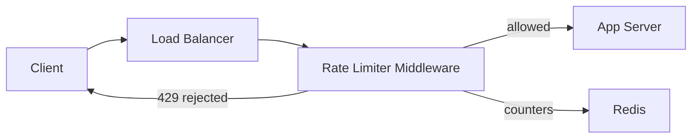

# 🚦 Design a Rate Limiter

> Protect a service by capping how many requests a client can make in a time window — the guardrail that keeps APIs alive under abuse and spikes.

---

## 🎯 The Problem

Without limits, a single buggy client or malicious attacker can flood your API and take it down for everyone. A **rate limiter** caps requests per client (say, 100 requests/minute) and rejects the excess with **HTTP 429 Too Many Requests**. It's used everywhere: login endpoints, public APIs, payment routes.

---

## 📝 Requirements

**Functional**
- Allow up to *N* requests per client per time window; reject the rest.
- Work correctly across many servers (a distributed limit, not per-machine).
- Return clear feedback (429 + `Retry-After`).

**Non-functional**
- **Very low latency** — it runs in front of *every* request, so it must add almost no delay.
- **Highly available** and memory-efficient.
- Accurate enough to be fair, without being a bottleneck.

---

## 🏗️ High-Level Architecture



The limiter is **middleware** that runs before your business logic. It reads and updates a counter in a **shared store (Redis)**. If the client is under the limit, the request passes through; otherwise it's rejected immediately. Redis is the key: it's fast, shared across all app servers, and supports atomic operations and automatic expiry.

---

## 🧮 The Algorithms

There are several ways to count, each with trade-offs:

| Algorithm | How it works | Trade-off |
| --- | --- | --- |
| **Fixed Window** | Count requests per fixed clock minute | Simple, but allows 2× bursts at window edges |
| **Sliding Window Log** | Store a timestamp per request | Perfectly accurate, but memory-heavy |
| **Sliding Window Counter** | Weighted blend of current + previous window | Great accuracy/memory balance ✅ |
| **Token Bucket** | Tokens refill at a rate; each request spends one | Allows controlled bursts, smooth ✅ |
| **Leaky Bucket** | Requests drain from a queue at a fixed rate | Smooths spikes into a steady stream |

**Token Bucket** is the most popular in practice. A bucket holds up to `capacity` tokens; tokens refill over time. Each request removes one token — if the bucket is empty, the request is rejected.

```
tokens = min(capacity, tokens + elapsed * refillRate)
if tokens >= 1: allow, tokens -= 1
else: reject (429)
```

---

## 🗄️ Data Model (in Redis)

| Key | Value | Notes |
| --- | --- | --- |
| `rl:{userId}` | count (fixed window) | TTL = window length; auto-resets |
| `rl:{userId}` | tokens + lastRefill (token bucket) | Updated atomically per request |

Redis is a perfect fit: `INCR` is atomic, keys can auto-expire with a TTL, and one store is visible to every app server.

---

## ⚖️ Deep Dives & Trade-offs

**Why not count in each server's memory?** Behind a load balancer, a client's requests land on different servers. Only a **shared store** gives a correct *global* count. Local counters would let a client send N×(number of servers) requests.

**Race conditions** — two requests reading the same counter at once could both be allowed. Solve this with an **atomic Redis operation** or a small **Lua script** that reads, checks, and updates in one step.

**Fail open vs fail closed** — if Redis is down, do you allow or block? User-facing APIs usually **fail open** (allow) to avoid outages; security-critical endpoints **fail closed** (block).

**What to limit by** — user ID, API key, or IP address, or a combination. IP-based limiting can unfairly group users behind shared NATs.

---

## 🧭 Scope, guarantees & capacity

The limiter decides whether a request may consume a named resource. It covers per-user, per-tenant, per-route, and global policies. Authentication, bot detection, billing, and a full WAF are adjacent systems, not replacements for rate limiting.

**Required guarantees**

- A policy has an explicit key, capacity, refill/window, scope, and version.
- One atomic decision both checks and consumes capacity.
- Rejected requests never reach the protected handler.
- The failure policy—open, closed, or locally degraded—is configured per route.
- Policy changes are versioned and auditable.

Example sizing: at 100,000 API requests/sec, a centralized check per request means the counter tier must sustain at least 100,000 operations/sec plus headroom. If a decision request/response is roughly 250 bytes, network traffic is ≈ 25 MB/sec each way before protocol overhead. A two-level design can lease small token batches to gateways, trading a bounded amount of overshoot for much lower central load.

---

## 📜 Policy and response contracts

```json
{
  "policyId": "login-per-account",
  "scope": "account_id",
  "algorithm": "TOKEN_BUCKET",
  "capacity": 5,
  "refillTokens": 1,
  "refillEverySeconds": 60,
  "failureMode": "FAIL_CLOSED",
  "version": 12
}
```

```http
HTTP/1.1 429 Too Many Requests
Content-Type: application/problem+json
Retry-After: 42
RateLimit-Limit: 5
RateLimit-Remaining: 0
RateLimit-Reset: 42

{"type":"rate-limit-exceeded","status":429,"policy":"login-per-account"}
```

The counter key should include policy version and a privacy-safe subject identifier, for example `rl:{policyId:v12}:{HMAC(accountId)}`. A keyed digest prevents raw email/account values from appearing in Redis keys or telemetry; the HMAC key belongs in a managed secret store and is rotated deliberately.

---

## 🔄 Atomic token-bucket decision

For each request at time `now`:

```text
elapsed     = max(0, now - last_refill)
refilled    = min(capacity, tokens + elapsed * refill_rate)
allowed     = refilled >= cost
new_tokens  = allowed ? refilled - cost : refilled
retry_after = allowed ? 0 : ceil((cost - refilled) / refill_rate)
```

Store `tokens` and `last_refill` together and execute this calculation as one Redis Function/Lua operation. Use server time or constrain clock skew; never perform a client-side read followed by a separate write. Expire idle buckets after the time needed to refill to capacity.

**Request flow**

1. Authenticate first when the policy uses a trusted user/tenant identity; otherwise fall back to a carefully parsed client IP.
2. Load a cached, signed/versioned policy and derive all applicable keys: global, tenant, user, and route.
3. Atomically consume from the strictest buckets. For multi-key consumption, colocate Redis hash-slot keys or evaluate policies sequentially with a documented small-race trade-off.
4. Attach remaining/reset metadata. On rejection, return `429` without invoking business logic.
5. Emit sampled allow metrics and unsampled deny/error metrics without logging sensitive identifiers.

---

## 🌍 Distributed and multi-region choices

| Model | Benefit | Cost |
| --- | --- | --- |
| Central Redis region | Most accurate global count | Cross-region latency and a large blast radius |
| Independent regional buckets | Low latency and high availability | Global quota can overshoot by number of regions |
| Quota leasing | Central service grants bounded token batches to regions | More moving parts; unused leases reduce utilization |
| Edge/local approximation | Fastest and absorbs attacks early | Must reconcile with an authoritative limiter |

For a global quota `N`, quota leasing can guarantee overshoot is bounded by outstanding leases. Allocate dynamically based on demand rather than statically stranding capacity. For security-sensitive endpoints, keep a small strict global/account limiter even when general traffic uses local buckets.

---

## 🧯 Failure modes & correctness

| Failure | Recommended behavior |
| --- | --- |
| Redis timeout | Public read API may fail open with a small local emergency limiter; login/payment generally fail closed |
| Policy service unavailable | Continue with last-known-good version until its safety TTL; alert on staleness |
| Hot tenant key | Shard only if bounded approximation is acceptable; otherwise isolate that tenant/policy |
| Counter replica lag | Send decisions to the authoritative primary; replicas are unsuitable for strict checks |
| Retry after upstream timeout | Count attempts by default; optionally use a request ID to avoid charging transport retries twice |
| Clock moves backward | Use datastore time or clamp elapsed to zero |

Rate limiting is intentionally approximate in many systems. State the tolerated overshoot and under-utilization explicitly. “Accurate” without a quantified error bound is not a useful requirement.

---

## 🔐 Security, privacy & operations

- Trust identity headers only from an authenticated gateway; strip client-supplied copies.
- Parse proxy forwarding headers only from known proxies, or clients can spoof the limited IP.
- Store no raw credentials or personal identifiers in counter keys. Protect configuration writes with RBAC, approvals, and an audit trail.
- Limit policy dimensions to an allow-list to prevent attackers creating unbounded-cardinality keys.
- Monitor decision latency, allow/deny/error counts by policy, Redis CPU/memory, script failures, hot keys, policy-version skew, local-fallback use, and estimated quota overshoot.
- Load-test the limiter beyond protected-service peak and fault-test Redis failover. A limiter that becomes the bottleneck is itself an outage source.

### Rollout

Start in **shadow mode**: compute decisions but do not reject. Compare expected and observed customer impact, then canary enforcement by route/tenant. Keep a kill switch and a last-known-good policy. Roll back configuration independently of application deployment.

### 60-second interview summary

“I put a token bucket at the gateway, derive trusted per-policy keys, and execute refill/check/decrement atomically in Redis. Policies define failure behavior and are versioned. For multi-region limits I choose between local approximation and quota leasing, state the overshoot bound, and monitor decision latency, hot keys, fallback use, and false rejections.”

### Further reading

- [Redis rate-limiter design and implementations](https://redis.io/docs/latest/develop/use-cases/rate-limiter/)
- [Redis `INCR` rate-limiter pattern](https://redis.io/docs/latest/commands/incr/)
- [Redis Cluster specification](https://redis.io/docs/latest/operate/oss_and_stack/reference/cluster-spec/)

---

## ❓ FAQs

### Why can't each server just keep its own counter in memory?
Because a client's traffic is spread across many servers by the load balancer. Per-server counters would each see only a fraction of the requests, so the client could exceed the real limit by a large multiple. A shared store gives one global count.

### How do you avoid race conditions on the counter?
Use atomic operations. Redis `INCR` is atomic, and for token bucket you run a small Lua script so the read-check-update happens as a single indivisible step.

### Which algorithm should you pick in an interview?
Token Bucket is the safe default — it's simple, allows reasonable bursts, and smooths traffic. Mention Sliding Window Counter if they want tighter accuracy.

### What should the response look like when a client is limited?
Return HTTP 429 with a `Retry-After` header and ideally `X-RateLimit-Remaining` so clients know when they can try again.
