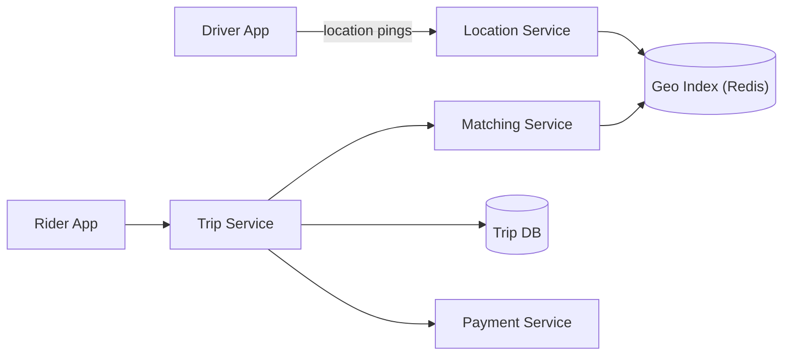

# 🚗 Design a Ride-Sharing Service (Uber)

> Match riders with nearby drivers in real time, track the trip live, and handle payment.

---

## 🎯 The Problem

**Uber/Lyft** connect a rider who needs a ride with a nearby available driver, in seconds. Drivers constantly move and report their location; riders request trips from anywhere. The core challenges are **finding nearby drivers fast** (a geo-spatial problem), **matching** them reliably, and **tracking** the trip in real time.

---

## 📝 Requirements

**Functional**
- Riders request a ride; the system finds and assigns a nearby available driver.
- Real-time location tracking during the trip.
- Fare calculation and payment.

**Non-functional**
- **Low-latency matching** — riders shouldn't wait.
- Highly available; accurate geo lookups at massive scale.
- Handle millions of location updates per second.

---

## 🏗️ High-Level Architecture



Drivers stream their location to a **Location Service** that keeps live positions in a **geo index**. When a rider requests a trip, the **Matching Service** queries that index for nearby drivers and assigns the best one. The **Trip DB** records the ride; the **Payment Service** handles the fare.

---

## 📍 Finding Nearby Drivers

Drivers send their coordinates every few seconds. The key question — *"which drivers are near this rider?"* — must be answered in milliseconds. A plain database scan won't do; we need **spatial indexing**:

- **Geohash** — encode a latitude/longitude into a short string where **nearby points share a prefix**. Finding neighbors becomes a prefix search.
- **QuadTree / S2 cells** — recursively divide the map into cells; query the rider's cell plus its neighbors.

Live positions are kept in **Redis** using its geo commands (`GEOADD`, `GEOSEARCH`), giving fast radius queries without hammering the main database.

---

## 🗄️ Data Model

**trips**

| Column | Type |
| --- | --- |
| `trip_id` | UUID PK |
| `rider_id` | BIGINT |
| `driver_id` | BIGINT |
| `status` | ENUM (REQUESTED / MATCHED / ONGOING / COMPLETED) |
| `start_loc`, `end_loc` | GEO |
| `fare` | DECIMAL |

**driver_locations (Redis):** `driverId → (lat, lng, updated_at)` in a geo index.

---

## ⚖️ Deep Dives & Trade-offs

**Location writes are enormous** — millions of pings per second. Keep them in an in-memory geo store (Redis), not the transactional database, which only records trips.

**Matching quality** — pick the driver with the shortest **ETA**, not just the shortest straight-line distance (traffic and one-way streets matter).

**No double-booking** — a driver must be locked to one trip. Use an atomic status change (`AVAILABLE → MATCHED`); the first request to flip the driver wins, the rest fail.

**Surge pricing** — a separate service watches supply vs demand per region and adjusts fares dynamically.

---

## 🧭 Scope, state & sizing

This design covers driver availability/location, ride requests, matching/offers, trip state, live tracking, fare estimate/finalization, and payment handoff. Route computation, identity/KYC, safety response, fraud, and payment internals are dependencies.

**Trip state machine**

```text
REQUESTED → SEARCHING → DRIVER_OFFERED → MATCHED → ARRIVING
        └──────────────→ NO_DRIVER | CANCELLED
ARRIVING → IN_PROGRESS → COMPLETED → PAYMENT_PENDING → PAID
```

**Invariants**

- One driver has at most one active assignment; one ride has at most one accepted driver.
- Only the rider/assigned driver and authorized support services can read live trip data.
- State transitions are versioned and monotonic.
- The durable trip record owns assignment; the geo index is a disposable search accelerator.
- A fare quote records map/pricing versions and expiry; final fare follows a documented contract.

Example: 1 million online drivers sending a location every 4 seconds produces 250,000 updates/sec. If 100,000 rides start per hour at peak, matching averages 28/sec but each request may inspect/offer several candidates. Location ingestion, not trip creation, usually dominates write volume.

---

## 📜 APIs and event contracts

| Contract | Result |
| --- | --- |
| `POST /v1/fare-quotes` | Price/ETA estimate, map + pricing version, expiration |
| `POST /v1/rides` with idempotency key | Stable ride in `REQUESTED/SEARCHING` |
| `POST /v1/rides/{id}/cancel` | Idempotent legal state transition |
| `WS /v1/drivers/location` | Sequenced, authenticated location updates |
| `WS /v1/rides/{id}/events` | Authorized trip/location/state subscription |

```json
{"driverId":"d-17","sessionId":"s-8","sequence":4412,
 "lat":28.6139,"lng":77.2090,"accuracyM":9,"heading":124,
 "capturedAt":"2026-08-08T10:30:04Z"}
```

Reject impossible coordinates, stale/out-of-order sequence values, excessive speed jumps, oversized frequency, and sessions not owned by the authenticated driver. Never trust a client-supplied driver/rider ID over the authenticated identity.

---

## 🗃️ Storage and indexing

| Store | Data | Retention/consistency |
| --- | --- | --- |
| Geo index | latest eligible driver position by H3/geocell | seconds/minutes TTL, eventual |
| Trip database | ride, participants, state/version, quote/fare refs | durable ACID |
| Availability store | driver state + assignment version | strongly coordinated per driver |
| Event log | location samples, offers, trip transitions | partition by driver/ride, bounded retention |
| Object/analytics store | historical route and marketplace aggregates | privacy-governed |

H3/geocells bucket locations into hierarchical regions; query the rider’s cell and expanding rings. Retrieve a bounded candidate set by freshness/availability, then ask a routing/ETA service for road-network estimates. Straight-line distance is only a cheap first-stage filter.

---

## 🔄 End-to-end matching flow

1. Create the ride idempotently with the accepted quote and pickup/dropoff coordinates rounded/encrypted per policy.
2. Select the cell and nearby rings, filtering location freshness, vehicle type, accessibility, driver state, and operational boundaries.
3. Rank candidates using ETA, driver idle time, acceptance likelihood, and fairness; pin strategy/model version.
4. Create a short-lived offer. Either offer sequentially or to a small batch; uncontrolled broadcast causes poor driver experience and races.
5. On acceptance, execute a conditional transaction: `ride.version/state` must still be searching and `driver.assignment` must be empty. The single winner sets both.
6. Emit `RideMatched` through an outbox and retract other offers idempotently.
7. During the trip, location streams to authorized subscribers; durable checkpoints are sampled rather than writing every ping to the trip row.
8. Completion calculates the final fare using recorded route/times/policy versions and hands an idempotent payment intent to the payment service.

---

## 🧯 Races, failures & degraded behavior

| Scenario | Behavior |
| --- | --- |
| Two riders select one driver | Conditional assignment allows one winner; loser continues search |
| Driver accepts after offer expiry | Reject with current ride/driver state |
| Location index loses data | Drivers repopulate via heartbeats; matching widens search/degrades gracefully |
| ETA service times out | Use bounded fallback estimate or defer offer; never block indefinitely |
| Matching worker crashes | Ride lease expires; another worker resumes with idempotent offer IDs |
| Rider/driver disconnects | Preserve state, push important events, and resync from sequence cursor |
| Region partition | Stop cross-boundary assignments; keep active-trip safety/location paths available where possible |

Cancellation and no-show fees must be deterministic functions of recorded timestamps/state and policy version. Support/manual overrides become append-only events, not silent row edits.

---

## 🔐 Safety, privacy & operations

- Use short-lived device sessions, device integrity/risk signals, rate limits, and server-side authorization for every trip object and live subscription.
- Location is highly sensitive: minimize precision/retention, encrypt it, prevent logging, restrict employee access, and provide auditable emergency access.
- Detect GPS spoofing/outliers using accuracy, sequence, speed, route, and device signals; do not let one signal automatically punish a user.
- Keep API/provider credentials and signing keys in managed secret/KMS/HSM systems.
- Monitor location freshness/ingestion lag, online drivers per cell, match/search/accept latency, candidate counts, offer expiry, assignment conflicts, unmatched rides, trip transition failures, WebSocket lag, ETA fallback, and payment handoff failures.

Canary matching strategies by city/cohort, shadow-score before enforcement, preserve a rollback version, and simulate stadium/event hotspots and cell-boundary effects.

### 60-second interview summary

“Drivers stream sequenced locations into an expiring H3/geocell index. A ride request searches expanding cells, filters fresh eligible drivers, ranks by ETA, and issues bounded offers. Acceptance uses a conditional transaction across ride and driver assignment so there is one winner. The durable trip state is authoritative; geo/location streams are rebuildable. All live reads are participant-authorized and location retention is minimized.”

### Further reading

- [Uber H3 engineering overview](https://www.uber.com/us/en/blog/h3/)
- [Apache Kafka ordering by key/partition](https://kafka.apache.org/documentation/)
- [PostgreSQL explicit row locking](https://www.postgresql.org/docs/current/explicit-locking.html)

---

## ❓ FAQs

### How do you find nearby drivers quickly?
Use spatial indexing — geohashing or a QuadTree — so "who is near this point?" becomes a fast prefix or cell lookup. Live driver positions are kept in an in-memory geo store like Redis for millisecond radius queries.

### Why not store driver locations in the main database?
Locations update millions of times per second. Writing that to a transactional DB would overwhelm it. An in-memory geo index handles the churn; the DB only stores durable trip records.

### How do you stop one driver being assigned to two riders?
Use an atomic state transition on the driver's status. Only the first request can flip a driver from AVAILABLE to MATCHED; concurrent requests fail and pick another driver.

### How is the rider shown the driver's live location?
The driver app streams its position continuously, and the rider app subscribes to the trip's live updates (via WebSocket or push) to animate the car on the map.
