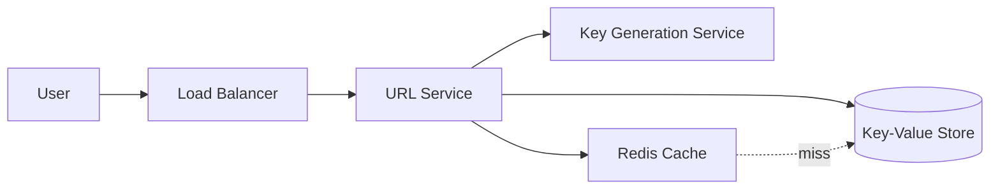

# 🔗 Design a URL Shortener (TinyURL)

> Turn long URLs into short ones and redirect users back — the classic HLD warm-up that teaches hashing, caching, and read-heavy scaling.

---

## 🎯 The Problem

Services like **TinyURL** and **bit.ly** take a long link and return a tiny one such as `short.ly/xY7bQz`. When someone visits it, they're instantly redirected to the original URL. It sounds trivial, but doing it for **billions of links and thousands of redirects per second** forces you to think about unique key generation, storage, and caching.

---

## 📝 Requirements

**Functional**
- Given a long URL, generate a unique short URL.
- Visiting a short URL redirects to the original long URL.
- Optional: custom aliases, link expiry, click analytics.

**Non-functional**
- **Read-heavy** — redirects vastly outnumber creations (~100:1). Reads must be fast (< 100 ms).
- **Highly available** — a broken short link is a broken promise.
- **Low latency** and virtually no downtime.

**Scale (back-of-the-envelope)**
- Assume **100M** new URLs/month → ≈ **40 writes/sec**.
- At 100:1 read:write → ≈ **4,000 redirects/sec**.
- Keep links for 5 years → 100M × 12 × 5 ≈ **6 billion** URLs to store.

---

## 🔌 API Design

```
POST /api/shorten      { longUrl, customAlias?, expiry? }  ->  { shortUrl }
GET  /{shortCode}       ->  HTTP 302 redirect to longUrl
```

---

## 🏗️ High-Level Architecture



**Write path** — the URL Service asks the Key Generation Service for a unique 7-character code, stores `code → longUrl` in the database, and returns the short URL.

**Read path** — a redirect looks up the code (checking the **cache first**, then the DB), then returns an HTTP **302** redirect to the original URL. Because the same popular links are hit repeatedly, the cache serves the vast majority of reads.

---

## 🔑 Generating the Short Code

The heart of the design is producing a **unique, short** code.

- Use **base62** encoding — the characters `[a-z, A-Z, 0-9]`. Just **7 characters** give 62⁷ ≈ **3.5 trillion** combinations, far more than the 6B we need.

**Two common approaches:**

- **Counter-based** — keep a global, ever-increasing number and base62-encode it. Guarantees uniqueness with **zero collisions**. To avoid a single counter bottleneck, hand out ID *ranges* to each server.
- **Digest-based** — compute a SHA-256 digest of the canonical URL plus a random salt and take enough base62 characters. This is stateless, but truncation can still collide, so the database must detect conflicts and retry. A digest does not remove the need for a uniqueness constraint.

> A pre-built **Key Generation Service (KGS)** generates unique keys ahead of time and hands them out in batches. It's fast and collision-free because keys are marked "used" the moment they're taken.

---

## 🗄️ Data Model

| Column | Type | Notes |
| --- | --- | --- |
| `short_code` | VARCHAR(7) | **Primary key** — the lookup key |
| `long_url` | TEXT | The destination |
| `created_at` | TIMESTAMP | When it was made |
| `expires_at` | TIMESTAMP | Optional expiry |
| `user_id` | BIGINT | Owner (optional) |

A **key-value / NoSQL store** (DynamoDB, Cassandra) is ideal: every lookup is a simple point query by `short_code`, and these stores scale horizontally with ease.

---

## ⚖️ Deep Dives & Trade-offs

**Caching** — put a Redis cache in front of the DB. With an LRU policy, hot links live in memory and most redirects never touch the database.

**Sharding** — with billions of rows, partition the data by a hash of `short_code` so writes and storage spread evenly across nodes.

**301 vs 302 redirect** — a **301 (permanent)** is cached by browsers, so later visits skip your server entirely (great for load, bad for analytics). A **302 (temporary)** routes every visit through you, letting you count clicks.

**Analytics** — on each redirect, fire an async event to a queue (Kafka). A separate service aggregates click counts so analytics never slow down the redirect.

---

## 🧭 Scope, assumptions & non-goals

This interview design covers link creation, redirection, custom aliases, expiration, and asynchronous click analytics. It does **not** attempt to build a full marketing attribution platform, malware scanner, or web crawler. Those can integrate later through events.

Use explicit assumptions so every estimate can be recomputed:

| Input | Interview assumption | Derived result |
| --- | ---: | ---: |
| New links | 100 million/month | ≈ 39 writes/sec average; plan 10× peak ≈ 400/sec |
| Redirect ratio | 100 redirects per create | ≈ 3,900 reads/sec average; ≈ 40,000/sec peak |
| Retention | 5 years | ≈ 6 billion active mappings |
| Mapping size | ≈ 600 bytes including indexes/metadata | ≈ 3.6 TB raw; budget 2–3× for replicas and indexes |
| Redirect egress | 1 KB response average | ≈ 40 MB/sec at estimated peak |

> These are sizing inputs, not facts about TinyURL. In an interview, ask for the real traffic, retention, URL length distribution, regions, and availability target before committing to a datastore.

**Key guarantees**

- A short code maps to at most one destination for its lifetime.
- A successful create is durable before the URL is returned.
- Redirects may briefly serve a cached mapping after an administrative update, but never after a hard safety block.
- Analytics are best-effort and must never increase redirect latency.

---

## 📜 API contracts

```http
POST /v1/links
Authorization: Bearer <token>
Idempotency-Key: 0b4c...f912
Content-Type: application/json

{
  "longUrl": "https://example.com/articles/system-design?chapter=4",
  "customAlias": "design-notes",
  "expiresAt": "2028-01-01T00:00:00Z"
}
```

```json
{
  "code": "design-notes",
  "shortUrl": "https://sho.rt/design-notes",
  "longUrl": "https://example.com/articles/system-design?chapter=4",
  "expiresAt": "2028-01-01T00:00:00Z",
  "createdAt": "2026-08-08T10:15:00Z"
}
```

| Endpoint | Success | Important failures |
| --- | --- | --- |
| `POST /v1/links` | `201 Created` | `400` invalid/unsafe URL, `409` alias taken, `429` quota exceeded |
| `GET /{code}` | `302 Found` | `404` unknown, `410 Gone` expired/deleted, `451` policy-blocked where applicable |
| `DELETE /v1/links/{code}` | `204 No Content` | `403` not owner, `404` unknown |
| `GET /v1/links/{code}/stats` | `200 OK` | `403` not owner; analytics may be delayed |

Validation at creation must allow only supported schemes (normally `http` and `https`), cap URL and alias lengths, normalize the host safely, reject control characters, and apply abuse/rate limits. Do not fetch the destination synchronously from the request path: that creates SSRF risk and unpredictable latency.

---

## 🗃️ Storage and key lifecycle

Use the code as a high-cardinality partition key. The creation write is conditional—`put if absent`—so the datastore, not an in-process check, owns uniqueness.

```sql
CREATE TABLE links (
    short_code   VARCHAR(32) PRIMARY KEY,
    long_url     TEXT NOT NULL,
    owner_id     UUID,
    state        VARCHAR(16) NOT NULL,
    created_at   TIMESTAMPTZ NOT NULL,
    expires_at   TIMESTAMPTZ,
    version      BIGINT NOT NULL
);

CREATE UNIQUE INDEX links_owner_idempotency
    ON link_requests(owner_id, idempotency_key);
```

At very large scale this logical schema can live in DynamoDB/Cassandra rather than one PostgreSQL table. Preserve the same invariants: conditional create, point read by code, and a separate owner-oriented index for management pages. Avoid putting sensitive data in partition keys because keys commonly appear in logs and operational metadata.

**Lifecycle:** `ACTIVE → DISABLED | EXPIRED | DELETED`. Keep tombstone/reservation metadata for a cooling-off period before reusing a custom alias; immediate reuse can redirect old browser caches to a new owner.

---

## 🔄 End-to-end flows

**Create**

1. Authenticate the owner; validate quota, URL, alias, and expiration.
2. Claim an idempotency record keyed by `(ownerId, idempotencyKey)`.
3. Allocate a code from a local batch supplied by the KGS, or validate the requested alias.
4. Conditionally write `short_code → destination`; retry a generated-code collision, but return `409` for a custom alias.
5. Commit the idempotency response and warm the cache.
6. Return only after durable storage succeeds.

**Redirect**

1. Normalize and validate the code; rate-limit obvious scanners.
2. Read the positive cache. Keep a short-lived **negative cache** for unknown codes to protect the database from enumeration traffic.
3. On miss, point-read the datastore and populate the cache with a TTL bounded by `expires_at`.
4. Check state, expiry, and safety blocks, then return `302 Location: <destination>`.
5. Publish a small analytics event asynchronously. Drop or sample analytics under pressure instead of slowing redirects.

**Update/delete**

1. Authorize ownership, change the durable row with an optimistic `version` check, then invalidate cache keys.
2. For urgent abuse blocks, update a small strongly refreshed deny cache first and fail closed if its status is unknown.

---

## 🧯 Failure handling, consistency & replay

| Scenario | Safe behavior | Why |
| --- | --- | --- |
| Client retries create | Return the stored response for the same idempotency key and payload | Prevents multiple links after a timeout |
| Cache unavailable | Read the datastore with circuit breaking and load shedding | Cache failure degrades latency, not correctness |
| Datastore unavailable | Existing hot links may continue from cache; new creates fail | Never acknowledge a link that is not durable |
| Analytics queue unavailable | Buffer briefly, sample, or drop metrics | Redirect correctness outranks analytics completeness |
| Region fails | Route to a replica region; define whether writes pause or use a single home region | Avoids two regions independently claiming one alias |
| KGS range exhausted | Fetch another range; generated-link creation may temporarily fail | Never guess or reuse a code |

For active-active reads, replicate link rows globally. For writes, either route each code/owner to a home region or use a globally conditional datastore. Custom alias ownership is the conflict that drives this decision.

---

## 🔐 Security, privacy & abuse controls

- Use TLS, authenticated management APIs, ownership checks, and least-privilege service identities. Keep signing keys and database credentials in a secrets manager—not source code.
- Prevent open-redirect abuse by displaying the destination domain on preview/admin screens, offering a report flow, and asynchronously scanning reputation. A shortener is intentionally a redirect service, so an allow-list of destinations is usually a product decision rather than a universal rule.
- Do not log full destination query strings: they can contain tokens or personal data. Log the code, destination host, outcome, latency, and a privacy-safe actor identifier.
- Rate-limit creates, redirects, and alias enumeration separately. Apply bot detection and per-tenant quotas.
- Encrypt stored destinations and analytics according to data classification; define retention and deletion behavior for click metadata.

---

## 📈 Operational readiness & evolution

Watch redirect success rate, p50/p95/p99 latency, cache hit ratio, datastore throttling, hot partitions, KGS inventory, invalid-code rate, analytics lag, and abuse blocks. Alert on customer-visible failures and on saturation **before** latency breaches the SLO.

Roll out in stages:

1. One region, PostgreSQL, cache-aside Redis, and a database sequence is sufficient for a small product.
2. Add replicated read storage, batched key allocation, CDN/edge redirects, and async analytics when traffic demands it.
3. Add multi-region reads, then deliberately choose a write-conflict policy before active-active creation.

**Alternatives considered:** random base62 codes simplify generation but require collision retries; a global counter guarantees uniqueness but can reveal volume and become a coordination hotspot; hashing the destination deduplicates identical URLs but makes custom lifecycles and privacy harder. There is no universally best choice—the workload decides.

### 60-second interview summary

“This is a read-heavy key-value system. I allocate collision-free base62 codes, conditionally persist `code → URL`, and serve redirects through a cache. Creation is idempotent and durable; analytics are asynchronous. I partition by code, protect hot/unknown keys, and define cache invalidation plus alias ownership before discussing multi-region writes.”

### Further reading

- [DynamoDB partition-key design](https://docs.aws.amazon.com/amazondynamodb/latest/developerguide/bp-partition-key-design.html)
- [DynamoDB security best practices](https://docs.aws.amazon.com/amazondynamodb/latest/developerguide/best-practices-security-preventative.html)
- [S3 presigned URL security model](https://docs.aws.amazon.com/AmazonS3/latest/userguide/using-presigned-url.html)

---

## ❓ FAQs

### How do you guarantee two long URLs never get the same short code?
Counter-based generation is inherently unique because each number maps to exactly one code. Hash-based generation can collide, so you check whether the code exists and retry with a tweak if it does.

### Should you use a SQL or NoSQL database here?
NoSQL fits best. The access pattern is a simple key lookup with no joins, and you need to scale to billions of rows — exactly what key-value stores are built for.

### How do you support custom aliases like `short.ly/my-brand`?
Try to insert the alias as the primary key. If the insert succeeds it's yours; if it fails, the alias is already taken and you ask the user for another.

### What happens when a link expires?
Store an `expires_at` timestamp and check it on read; expired links return 404. A background job can also purge expired rows to reclaim space.
