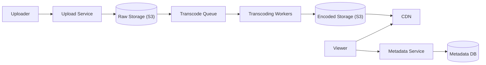

# 🎬 Design Video Streaming (YouTube)

> Upload, transcode, store, and stream video to millions with smooth, adaptive playback.

---

## 🎯 The Problem

**YouTube/Netflix** let anyone upload a video and everyone else watch it on any device and network — from a phone on 3G to a 4K TV on fiber. The hard parts are **storing enormous files**, **converting them into many formats**, and **delivering them smoothly** without buffering, all while views massively outnumber uploads.

---

## 📝 Requirements

**Functional**
- Upload videos; play them on any device and connection speed.
- Search, view counts, thumbnails, recommendations.

**Non-functional**
- Smooth playback with adaptive quality; minimal buffering.
- Highly available and massively scalable storage.
- **Read-heavy** — one upload may be watched millions of times.

---

## 🏗️ High-Level Architecture



Uploads land in raw **object storage**. A **transcoding pipeline** converts them into multiple resolutions and stores the results, which are served to viewers through a **CDN**. Video *metadata* (title, uploader, view count) lives in a separate database.

---

## 🎞️ The Transcoding Pipeline

A raw upload is huge and single-quality — useless for a phone on slow data. So **transcoding workers** process each video:

1. **Encode** it into multiple resolutions/bitrates (240p, 480p, 720p, 1080p, 4K).
2. **Segment** each version into small chunks (a few seconds each) using **HLS** or **DASH**.
3. Generate a **manifest** listing all the chunks and qualities.

The player then does **Adaptive Bitrate Streaming (ABR)**: it measures your bandwidth and fetches the next chunk at the highest quality that won't buffer — switching quality on the fly as your network changes.

---

## 🗄️ Data Model

**videos**

| Column | Type |
| --- | --- |
| `video_id` | UUID PK |
| `uploader_id` | BIGINT |
| `title`, `description` | TEXT |
| `status` | ENUM (UPLOADING / PROCESSING / READY) |
| `manifest_url` | TEXT (HLS/DASH playlist) |
| `views` | BIGINT |

The video **bytes** live in **object storage (S3)** and are served via a **CDN**; only lightweight metadata lives in the database.

---

## ⚖️ Deep Dives & Trade-offs

**The CDN is essential** — a Content Delivery Network caches video chunks at edge locations near viewers. This slashes latency and buffering and offloads almost all traffic from your origin servers. Without it, streaming globally would be impossible.

**View counts** — don't update a counter synchronously on every play (that's a write hotspot). Instead, emit an async event to a queue and aggregate counts in the background; exact real-time numbers aren't needed.

**Resumable uploads** — big files fail mid-upload on flaky networks. Support chunked, resumable uploads straight into object storage.

**Thumbnails** — generated during transcoding and also served via the CDN.

---

## 🧭 Scope, lifecycle & capacity

This design covers resumable upload, validation, transcoding/packaging, metadata publication, authorized playback, CDN delivery, view events, and deletion. Search/recommendation, live streaming, ads, DRM internals, and moderation ML are separate deep dives.

```text
CREATED → UPLOADING → UPLOADED → SCANNING → TRANSCODING → READY
      └──────────────────────────────→ REJECTED | FAILED
READY → BLOCKED | DELETING → DELETED
```

**Invariants:** only completed/validated uploads enter processing; a video becomes public only after required renditions and policy checks succeed; manifests reference immutable versioned segments; metadata state is authoritative for authorization even if CDN objects remain cached.

Example assumptions: 1 million uploads/day × 500 MB average is ≈ 500 TB/day ingest. If encoded renditions total 1.5× source size, generated output adds ≈ 750 TB/day before replication. Ten million viewing hours/day at an average 3 Mbps is roughly 135 PB/day egress—showing why CDN hit ratio and encoding ladder dominate cost.

---

## 📜 Upload and playback contracts

```http
POST /v1/videos
Idempotency-Key: <uuid>
{"title":"System design lesson","sizeBytes":734003200,"contentType":"video/mp4"}

POST /v1/videos/{id}/upload-parts
{"partNumber":17,"checksum":"sha256:..."}

POST /v1/videos/{id}/complete-upload
{"parts":[{"partNumber":1,"etag":"..."}]}

GET /v1/videos/{id}/playback
→ {"manifestUrl":"short-lived signed CDN URL","expiresAt":"..."}
```

The API issues scoped, short-lived upload grants to a server-generated object key. Bind content length/type/checksum where supported, cap parts and total size, and never let a client select an arbitrary bucket/key. Completion verifies all parts and checksum before emitting `UploadCompleted`.

---

## 🗃️ Metadata and object layout

| Record | Important fields |
| --- | --- |
| `video` | id, owner, visibility, state/version, source_ref, duration, policy state |
| `upload_session` | id, expected size/checksum, object key, expiry, completed_at |
| `transcode_job` | video_id, pipeline_version, attempt, state, lease, error |
| `rendition` | codec, resolution, bitrate, manifest/object prefix, checksum |
| `view_event` | event_id, video_id, viewer/session, qualified_duration, occurred_at |

Use immutable paths such as `videos/{videoId}/{pipelineVersion}/{rendition}/segment-001.m4s`. Publishing switches the metadata/manifest pointer atomically; workers never overwrite a rendition currently served. Lifecycle rules remove abandoned multipart uploads, superseded pipeline versions, and deleted content after the required retention window.

---

## 🔄 Processing and playback flows

**Upload/process**

1. Authenticate owner, validate quota/metadata, create an expiring upload session, and return multipart grants.
2. Client uploads directly to object storage and retries individual parts.
3. Completion verifies size/checksum and atomically marks `UPLOADED` with an outbox event.
4. Scan file structure/malware and extract trusted metadata in a sandbox with CPU/memory/time limits.
5. A workflow creates idempotent jobs for rendition ladder, audio, captions, thumbnails, and manifest packaging.
6. Each job writes to a versioned temporary prefix and commits a completion marker. The orchestrator publishes `READY` only when the minimum playback set and moderation policy pass.

**Playback**

1. Metadata service authenticates viewer and evaluates visibility, geography, subscription, age, block, and takedown state.
2. It returns a short-lived signed manifest URL/cookie.
3. Player fetches the master manifest and measures throughput/buffer to choose rendition segments.
4. CDN serves cached segments; origin access is restricted to the CDN. Player emits sampled QoE events asynchronously.

---

## 🧯 Retry, failure & deletion

Jobs are at least once. A deterministic key `(videoId, pipelineVersion, outputName)` and immutable output make retries safe. Use leases/heartbeats, exponential backoff with jitter, bounded attempts, and a DLQ/manual reprocess path.

| Scenario | Behavior |
| --- | --- |
| Client upload disconnects | Resume missing parts before session expiry |
| Worker dies mid segment set | Lease expires; retry writes same temporary/versioned output safely |
| One optional rendition fails | Publish minimum ladder if product policy allows; continue repair |
| CDN/origin miss storm | Request coalescing, origin shield, capacity limits |
| Metadata DB unavailable | Fail closed for private/paid content; public cached content follows explicit policy |
| Takedown/delete | Deny playback first, revoke signing authorization, purge CDN, then asynchronously delete objects |

View counts use unique event IDs and stream aggregation. Define what qualifies as a view and make reprocessing deterministic; approximate public counters need not block playback.

---

## 🔐 Security, privacy & operations

- Sandbox parsers/encoders because uploaded media is hostile input. Validate by content, not extension; enforce decompression/resource limits.
- Use TLS, private buckets, least-privilege roles, server-side encryption/KMS, signed short-lived playback, and secrets management. Never expose storage credentials.
- Authorize playback before issuing a token; CDN tokens include resource scope and expiry. DRM/licensing requires a dedicated threat model.
- Strip sensitive metadata where appropriate and define retention/deletion for source files, IP/device/QoE events, and watch history.
- Monitor upload success/throughput, abandoned sessions, queue age, transcode duration/failure by codec, time-to-ready, storage growth, CDN hit ratio/origin egress, playback start time, rebuffer ratio, fatal playback errors, authorization denials, and purge latency.

Canary a new encoder/pipeline version on copied source, compare output quality/cost, and roll back by switching manifest metadata. Never rewrite existing segments in place.

### 60-second interview summary

“Clients upload multipart directly to object storage with scoped grants. Completion emits an outbox event; sandboxed, idempotent workers generate an immutable versioned rendition ladder and HLS manifests. Metadata publishes READY atomically. Playback authorizes the viewer, returns short-lived CDN access, and the player adapts bitrate by segment. I isolate origin with CDN, make jobs replay-safe, and deny before purge on takedown.”

### Further reading

- [Apple HTTP Live Streaming overview](https://developer.apple.com/documentation/HTTP-Live-Streaming)
- [Amazon CloudFront video-on-demand architecture](https://docs.aws.amazon.com/AmazonCloudFront/latest/DeveloperGuide/on-demand-video.html)
- [Amazon S3 presigned uploads](https://docs.aws.amazon.com/AmazonS3/latest/userguide/PresignedUrlUploadObject.html)

---

## ❓ FAQs

### Why store video in object storage instead of a database?
Databases aren't designed for huge binary blobs; they'd be slow and expensive. Object storage (S3) is cheap, virtually infinite, durable, and integrates directly with CDNs for delivery.

### How does video quality adjust automatically as I watch?
Through adaptive bitrate streaming. The video is pre-encoded at several qualities and split into small chunks. The player measures your current bandwidth and picks the best-quality chunk that plays without buffering, switching as your connection changes.

### Why is a CDN so important for streaming?
It caches video chunks close to users geographically, so playback starts fast and doesn't buffer, while dramatically reducing load on your origin servers.

### How do you handle millions of simultaneous view-count updates?
Don't write to the DB on every view. Send view events to a message queue and aggregate them asynchronously — the count is eventually accurate without creating a database hotspot.
