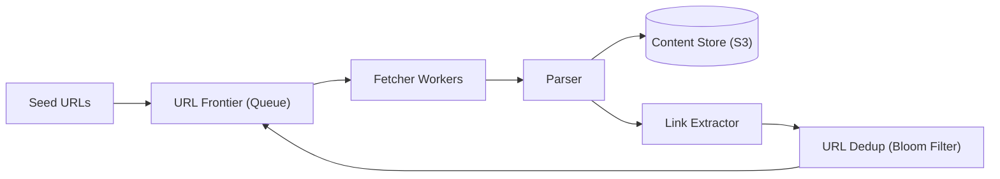
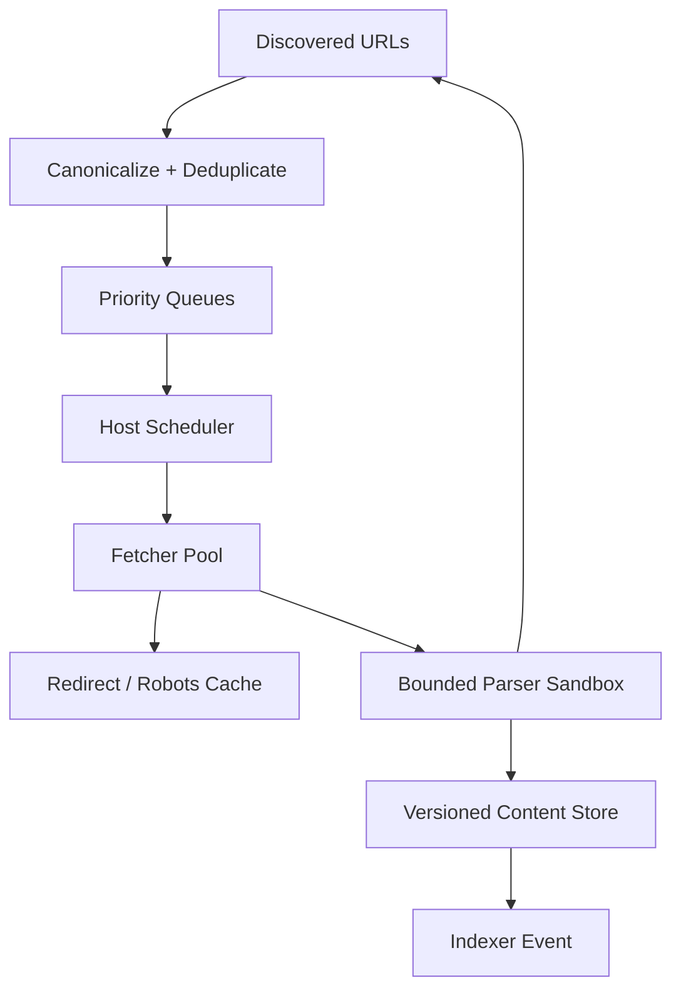

# 🕷️ Design a Web Crawler

> Systematically browse the web, download pages, and extract links — the engine behind search engines like Googlebot.

---

## 🎯 The Problem

A **web crawler** starts from a set of seed URLs, downloads each page, extracts the links on it, and repeats — discovering and fetching a huge portion of the web. Search engines use crawlers to build their index. The challenge is doing this at the scale of **billions of pages**, politely (without overwhelming any site), and without getting stuck in loops.

---

## 📝 Requirements

**Functional**
- Start from seed URLs, fetch pages, extract and follow links.
- Store page content for later indexing.
- Respect `robots.txt` and avoid re-crawling the same page too often.

**Non-functional**
- **Scalable** to billions of pages.
- **Polite** — don't hammer a single server.
- **Fault-tolerant** and able to run for weeks.

---

## 🏗️ High-Level Architecture



The **URL Frontier** decides what to crawl next. **Fetcher workers** download pages, the **parser** saves content and extracts links, and a **dedup** step (a Bloom filter) drops URLs we've already seen before adding new ones back to the frontier. It's a continuous loop.

---

## 🧭 The URL Frontier

The **frontier** is the brain of the crawler — a set of queues that decide *what to crawl next* and *how fast*. It enforces two priorities:

- **Politeness** — never bombard one host. Requests to the same domain are spaced out (e.g., one every few seconds), often by giving each host its own queue.
- **Priority** — important or frequently-changing pages (news homepages) get crawled sooner and more often than obscure ones.

---

## 🗄️ Data Model

**pages**

| Column | Type |
| --- | --- |
| `url_hash` | VARCHAR PK |
| `url` | TEXT |
| `content_ref` | TEXT (S3 key) |
| `last_crawled` | TIMESTAMP |
| `checksum` | VARCHAR (detect changes) |

Raw HTML lives in **object storage**; the metadata table tracks what's been crawled and when.

---

## ⚖️ Deep Dives & Trade-offs

**Dedup with a Bloom filter** — checking "have we seen this URL?" against billions of entries in a database would be far too slow. A **Bloom filter** is a tiny, in-memory probabilistic set: it answers instantly, using little memory, with a small false-positive rate (it may occasionally skip a new URL, which is acceptable).

**Politeness vs speed** — crawling faster risks getting your IP banned. Per-host rate limits and honoring `robots.txt` keep you welcome.

**Freshness** — the web changes. Re-crawl volatile pages (news) often and stable pages (archives) rarely, using adaptive scheduling and the stored `checksum` to detect changes.

**Crawler traps** — some sites generate infinite URLs (calendars, faceted filters). Cap crawl depth and detect suspicious patterns to avoid getting stuck.

---

## 🧭 Scope, guarantees & sizing

This design discovers public HTTP(S) documents, schedules polite fetches, parses supported content, stores versions, and emits documents/links for indexing. Ranking, query serving, JavaScript rendering at arbitrary scale, and bypassing authentication/paywalls are out of scope.

**Rules/invariants**

- `robots.txt` is a crawl-control protocol, not authorization; the crawler still obeys it and never treats allowed paths as permission to access private data.
- One host’s slowness or trap cannot block the global frontier.
- Every fetch has bounded bytes, redirects, decompression, time, and parser resources.
- Canonicalization is versioned and conservative; distinct resources must not be merged merely because URLs look similar.
- At-least-once scheduling is acceptable because fetch/store/index steps are idempotent.

Example: 1 billion pages/month is ≈ 386 fetches/sec average. At 500 KB average response, ingest is ≈ 193 MB/sec and 500 TB/month before compression. A 10 billion URL seen-set at 1% Bloom-filter false-positive probability needs roughly 12 GB of bits, plus a durable exact URL registry for correctness-sensitive scheduling.

---

## 📜 URL task contract

```json
{
  "urlId": "sha256:...",
  "canonicalUrl": "https://example.org/docs?page=2",
  "hostKey": "https://example.org:443",
  "discoveredAt": "2026-08-08T10:40:00Z",
  "sourceUrlId": "sha256:...",
  "priority": 0.72,
  "notBefore": "2026-08-08T10:41:00Z",
  "crawlPolicyVersion": 4,
  "attempt": 0
}
```

Normalize scheme/host case, remove default ports and fragments, resolve relative paths, normalize safe percent encoding, and sort/drop query parameters only under an explicit per-site rule. Preserve the original URL for audit. Use a cryptographic digest such as SHA-256 as an identifier—not to imply content trust.

---

## 🧩 Frontier architecture



Use front queues for global priority and back queues keyed by host. The host scheduler maintains `nextAllowedAt`, crawl delay policy, concurrency, DNS/IP, robots version/expiry, and failure backoff. A heap/timing wheel releases only eligible hosts, ensuring politeness without idle workers.

---

## 🔄 End-to-end fetch lifecycle

1. Canonicalize a discovery and consult an in-memory Bloom filter; potential-new URLs go through an exact conditional insert in the durable URL registry.
2. Compute priority/freshness and enqueue with a host key.
3. Scheduler loads cached robots policy. Per RFC behavior, handle success, redirects, unavailable, and unreachable cases deliberately; cache policy within the protocol’s limits.
4. Resolve DNS and validate every redirect target. Block loopback, link-local, private, metadata-service, and disallowed network ranges to prevent SSRF.
5. Fetch with a descriptive user-agent, per-host concurrency/rate, conditional headers (`If-None-Match`/`If-Modified-Since`), redirect cap, byte/time/decompression limits.
6. Validate content type using headers plus safe sniffing; parse in a sandbox. Store content-addressed compressed bytes and immutable fetch metadata.
7. Canonicalize/exact-dedup extracted links and return them to the frontier. Emit a versioned document event to indexing.
8. Schedule recrawl from observed change rate, importance, cache headers, errors, and crawl budget.

---

## 🗃️ Durable records

| Record | Key fields |
| --- | --- |
| URL registry | url_id, canonical_url, host_key, first/last_seen, next_fetch, priority |
| Fetch attempt | url_id, attempt_id, timestamps, status, redirect chain, bytes, policy version |
| Document version | content_hash, storage_ref, mime, charset, parsed metadata |
| Host state | host_key, robots_ref/version, next_allowed, backoff, DNS/IP history |
| Link edge | source_url_id, target_url_id, relation, discovered_at |

Separate fetch attempts from document versions: `304 Not Modified` creates an attempt without duplicating content. Content hashes deduplicate identical bytes, while canonical URL IDs preserve separate resources and redirect history.

---

## 🧯 Failure, traps & replay

| Scenario | Behavior |
| --- | --- |
| Worker crashes after fetch | Lease expires; retry creates same content hash and deduped attempt/event |
| Host returns `429/503` | Honor `Retry-After`, exponential backoff, reduce host concurrency |
| Redirect loop | Stop after bounded hops; record terminal reason |
| DNS rebinding | Re-resolve/validate IP on connect and redirects; block forbidden ranges |
| Infinite calendar/faceted URLs | Per-host budgets, query-pattern rules, path-depth and similarity detection |
| Parser exploit/zip bomb | Kill sandbox on resource limit; quarantine sample and continue |
| Frontier partition fails | Restore durable queue/checkpoints; exact URL registry suppresses duplicates |

Bloom filters may say “seen” for a new URL. Use them to reduce exact lookups only when that false-positive trade-off is accepted; for comprehensive crawl guarantees, verify positives against a durable registry or tiered filter.

---

## 🔐 Security, ethics & operations

- Fetch only public `http/https`; never send platform credentials/cookies to sites. Isolate fetcher networks from internal control/data planes.
- Treat all content, redirects, DNS, headers, filenames, and encodings as hostile. Patch parser libraries, sandbox execution, and cap resources.
- Identify the crawler and publish contact/opt-out information. Honor robots rules, host rate limits, takedown/legal controls, and privacy retention.
- Keep service credentials/certificates outside source in managed stores; validate TLS chains/hostnames and record failures without bypassing verification.
- Monitor frontier depth/age, fetch throughput/latency/status, robots denials, per-host concurrency, bytes/decompression ratio, redirect/DNS failures, duplicate/content-change rate, parser failures, trap detection, index lag, and recrawl freshness.

Canary new canonicalization/parser/politeness versions, shadow their decisions, and retain enough metadata to replay without refetching. A bad canonicalizer can silently erase discoverability, so rollback/versioning matters.

### 60-second interview summary

“I use a durable priority frontier with per-host back queues and `nextAllowedAt` scheduling. URLs are conservatively canonicalized, Bloom-filtered, then conditionally registered. Fetchers honor cached robots policy, validate DNS/redirects against SSRF, and enforce strict resource limits before sandboxed parsing. Content is versioned by hash, extracted links loop back idempotently, and recrawl cadence follows importance and observed change rate.”

### Further reading

- [RFC 9309: Robots Exclusion Protocol](https://www.rfc-editor.org/rfc/rfc9309.html)
- [Google Research: Web Crawling](https://research.google/pubs/web-crawling/)
- [Google: Anatomy of a Large-Scale Hypertextual Web Search Engine](https://research.google/pubs/the-anatomy-of-a-large-scale-hypertextual-web-search-engine/)

---

## ❓ FAQs

### How do you avoid crawling the same page over and over?
Keep a "seen" set. A Bloom filter answers "have we visited this URL?" in constant time using tiny memory, so duplicate links are dropped before being queued. Pages are only re-crawled after a freshness interval.

### Why use a Bloom filter instead of a database lookup?
At billions of URLs, a database hit per link would be far too slow and expensive. A Bloom filter lives in memory, answers instantly, and trades a small false-positive rate for huge speed and space savings.

### How does a crawler stay "polite"?
It honors each site's `robots.txt` rules and throttles requests per domain (via the frontier's per-host queues) so it never overwhelms a single server.

### How do you keep the index fresh as pages change?
Re-crawl pages on a schedule tuned to how often they change, and compare a stored checksum to detect whether the content actually changed since last time.
