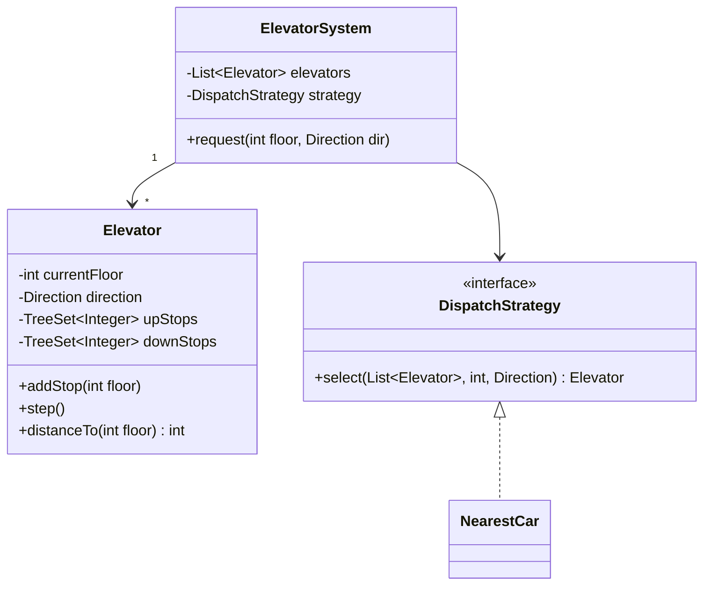

# 🛗 Design an Elevator System

> Model elevator cars, hall/cabin requests, and the scheduling logic that decides which car serves a call.

---

## 🎯 The Problem

Design the control software for a building with **multiple elevators**. People press "up"/"down" buttons on floors (**hall calls**) and floor buttons inside the cabin (**car calls**). A dispatcher must assign requests to the best elevator, and each elevator must move efficiently — serving all stops in one direction before reversing. This is the textbook problem for the **State** and **Strategy** patterns.

---

## 📝 Requirements

- Multiple elevators serving many floors.
- Handle **external** requests (hall call: up/down) and **internal** requests (cabin buttons).
- A dispatcher assigns each request to the most suitable car.
- An elevator moves up/down, stops to open doors, and serves requests efficiently.

---

## 🧭 Design Approach

- **State pattern** for elevator states (Idle, MovingUp, MovingDown, DoorsOpen) — behavior depends on the current state.
- **Strategy pattern** for the dispatch algorithm (nearest-car, or full SCAN/LOOK), so scheduling can evolve.
- Each elevator keeps **sorted sets** of pending up/down stops — the basis of the efficient "elevator algorithm" (LOOK).

---

## 🧱 Class Diagram



---

## 💻 Core Code

```java
enum Direction { UP, DOWN, IDLE }

class Elevator {
    private int currentFloor = 0;
    private Direction direction = Direction.IDLE;
    private final TreeSet<Integer> upStops = new TreeSet<>();
    private final TreeSet<Integer> downStops = new TreeSet<>(Collections.reverseOrder());

    void addStop(int floor) {
        if (floor > currentFloor) upStops.add(floor);
        else if (floor < currentFloor) downStops.add(floor);
        if (direction == Direction.IDLE)
            direction = floor > currentFloor ? Direction.UP : Direction.DOWN;
    }

    // Advance one floor toward the next stop (the LOOK algorithm).
    void step() {
        if (direction == Direction.UP) {
            if (upStops.isEmpty()) { direction = downStops.isEmpty() ? Direction.IDLE : Direction.DOWN; return; }
            currentFloor++;
            upStops.remove(currentFloor); // arrived -> open doors
        } else if (direction == Direction.DOWN) {
            if (downStops.isEmpty()) { direction = upStops.isEmpty() ? Direction.IDLE : Direction.UP; return; }
            currentFloor--;
            downStops.remove(currentFloor);
        }
    }

    int distanceTo(int floor) { return Math.abs(currentFloor - floor); }
}

interface DispatchStrategy {
    Elevator select(List<Elevator> cars, int floor, Direction dir);
}

class NearestCar implements DispatchStrategy {
    public Elevator select(List<Elevator> cars, int floor, Direction dir) {
        return cars.stream()
            .min(Comparator.comparingInt(e -> e.distanceTo(floor)))
            .orElseThrow();
    }
}

class ElevatorSystem {
    private final List<Elevator> elevators;
    private final DispatchStrategy strategy;
    ElevatorSystem(List<Elevator> elevators, DispatchStrategy strategy) {
        this.elevators = elevators;
        this.strategy = strategy;
    }
    void request(int floor, Direction dir) {
        strategy.select(elevators, floor, dir).addStop(floor);
    }
}
```

---

## ⚖️ Design Decisions

**The LOOK algorithm** — the elevator keeps moving in its current direction, serving every stop along the way, then reverses when there are no more stops ahead. This is efficient and prevents starvation (nobody waits forever).

**Sorted stop sets** — `TreeSet` keeps upcoming stops ordered, so "the next stop" is always the first element. This is what makes single-direction sweeps clean.

**Pluggable dispatch** — `NearestCar` is simple, but you can swap in a smarter strategy that also considers direction and current load.

---

## ✅ Invariants and clarified scope

This model covers normal dispatch for multiple cars, hall/cabin calls, door cycles, capacity, emergency/service modes, and sensor events. Physical motor controllers, fire-code certification, destination-control optimization, and distributed building networking are outside the interview core but must be acknowledged.

- A car never moves while its doors are not closed/locked.
- Door opening happens only when the car is stopped and aligned at a valid floor.
- A stop request is served once and can be repeated after completion.
- Each car has one authoritative controller/state-machine thread.
- Emergency/fire/service state overrides normal scheduling.
- Sensor disagreement fails safe: stop/hold doors and raise an alarm.

The existing code demonstrates LOOK queues, but a real state model separates motion direction from operational state. `direction=UP` and `state=DOORS_OPEN` are not competing enum values.

---

## 🧩 Domain model and responsibilities

| Type | Responsibility |
| --- | --- |
| `ElevatorSystem` | Own cars/controllers and receive building-level events |
| `Dispatcher` / `DispatchStrategy` | Assign unowned hall calls; reassign timed-out calls |
| `ElevatorController` | Serialize one car’s events and enforce safety transitions |
| `StopPlan` | Ordered up/down stops, deduplication, next-stop selection |
| `DoorController` / `MotorPort` | Hardware commands/acknowledgements behind interfaces |
| `CarState` | `IDLE`, `MOVING`, `LEVELING`, `DOORS_OPENING`, `DOORS_OPEN`, `DOORS_CLOSING`, `FAULT` |
| `HallCall` | Floor, desired direction, created time, assignment/lease |

`distanceTo` alone is not a good dispatch score. A car three floors away moving past the caller may be worse than a car five floors away already approaching. A useful score includes estimated pickup time, direction compatibility, scheduled stops, load/capacity, service zone, and aging.

---

## 🔄 Event-driven lifecycle

**Hall call**

1. Panel emits `(floor, direction, requestId)`; the system deduplicates a still-active call.
2. Dispatcher filters operational cars that serve the floor and have capacity.
3. Strategy estimates pickup cost and assigns the call with a lease/version.
4. Controller inserts the floor into its `StopPlan`; panel receives assigned/accepted indication.
5. If the car faults or misses the lease heartbeat, dispatcher reassigns safely.

**Car movement**

```text
IDLE --next stop--> DOORS_CLOSING --locked--> MOVING
MOVING --near target--> LEVELING --aligned/stopped--> DOORS_OPENING
DOORS_OPENING --open sensor--> DOORS_OPEN --timer/close--> DOORS_CLOSING
DOORS_CLOSING --obstruction--> DOORS_OPENING
DOORS_CLOSING --locked--> MOVING | IDLE
ANY --safety fault--> FAULT
```

Events—not arbitrary callers—drive transitions: floor sensor, speed sensor, door lock, obstruction, overload, alarm, timer, and hardware acknowledgement. Illegal transitions are rejected and recorded.

---

## 🔒 Concurrency, fairness and recovery

Give each car a single-threaded event loop/mailbox. It processes calls and sensors in order, so `StopPlan` needs no scattered locks. The building dispatcher owns only assignment; it does not mutate car internals directly.

Prevent starvation by aging hall calls in the score and defining a maximum wait alert/reassignment. LOOK serves all stops in the current sweep, but a continuously arriving stream ahead of the car can still require fairness rules or a bounded sweep.

On controller restart, recover durable active calls and car-reported physical state, then enter a safe reconciliation mode. Software must not assume the car is at the last persisted floor. Hardware safety circuits remain independent from application software.

---

## 🧪 Test plan

| Test | Expected result |
| --- | --- |
| Request ahead in same direction | Inserted into current sweep |
| Request behind moving car | Deferred to reverse sweep unless strategy reassigns |
| Door obstruction | Reopens; car never moves |
| Overload | Doors remain open and departure is blocked |
| Car faults after assignment | Hall call lease expires and is reassigned |
| Repeated panel press | One active hall call, no duplicate stop |
| Continuous traffic | Old request ages into priority; bounded wait |
| Sensor events out of order | Illegal/stale event rejected by sequence/state |

Use a fake `Clock`, fake motor/door ports, deterministic event queue, and property tests for safety invariants. Simulation tests measure mean/p95 wait, travel time, capacity, fairness, and energy—not only functional correctness.

---

## 🌱 Extensions and trade-offs

Destination dispatch collects the destination before boarding and groups riders, but changes the call model. Zoning dedicates cars to floor bands. Peak modes alter scoring for morning up-traffic/evening down-traffic. These belong behind dispatch/stop-plan policies while the safety state machine stays fixed.

### Interview walkthrough

“I separate the building dispatcher from one serialized controller per car. The dispatcher leases hall calls using ETA/direction/load/age; the controller owns a LOOK-based stop plan and explicit door/motion safety state machine. Sensors drive legal transitions, safety faults override scheduling, and call aging/reassignment prevents starvation and car-failure loss.”

### Further reading

- [Java concurrency building blocks](https://docs.oracle.com/en/java/javase/21/core/concurrency.html)
- [Java `Clock` for deterministic timers](https://docs.oracle.com/en/java/javase/21/docs/api/java.base/java/time/Clock.html)

---

## ❓ FAQs

### What scheduling algorithm do real elevators use?
Variants of **SCAN/LOOK**: the car keeps going in one direction, serving all requests along the way, then reverses. It's efficient and avoids starvation, unlike naively serving requests in arrival order.

### Why is the State pattern a good fit here?
Because what a button press *does* depends entirely on the elevator's current state — pressing a floor while moving up differs from pressing it while idle. Encapsulating each state keeps transition logic clean instead of a giant if/else.

### How would you improve the dispatch beyond "nearest car"?
Score each elevator by a combination of direction (a car already heading toward the caller is better), distance, and current load — then pick the best. Because dispatch is a Strategy, you swap it in without touching the elevators.

### How do you prevent a request from waiting forever (starvation)?
LOOK helps, but it is not a complete guarantee under continuous arrivals or repeated reassignment. Age hall calls in dispatch scoring, bound a sweep, track maximum wait, and lease/reassign calls from failed cars so an old request eventually outranks newer work.
