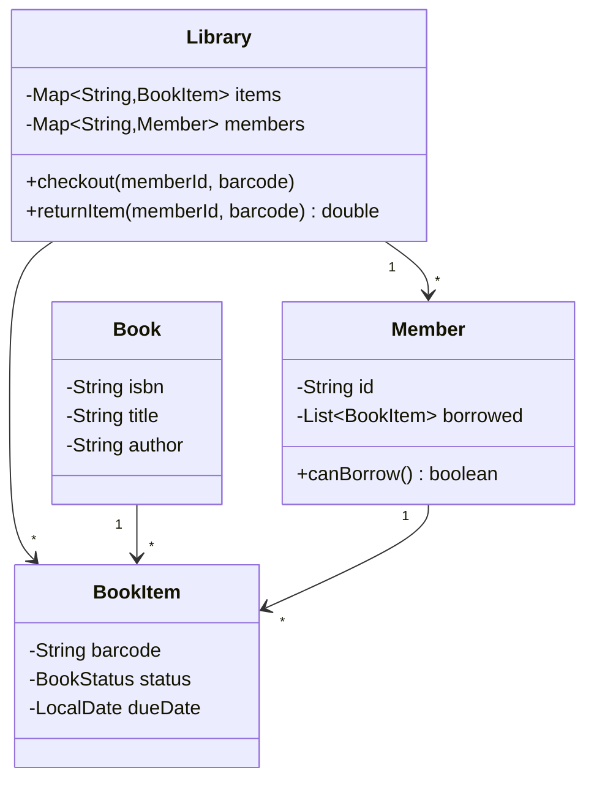

# 📚 Design a Library Management System

> Model books, members, and the borrow/return lifecycle with limits, due dates, and fines.

---

## 🎯 The Problem

Design the software for a library: members search a catalog, borrow physical copies of books, and return them — paying a fine if they're late. A key modeling insight is separating a **book title** (metadata, one per ISBN) from a **physical copy** (a specific item with a barcode and status).

---

## 📝 Requirements

- A catalog of books; each title can have multiple physical copies.
- Members can **borrow** and **return** copies, up to a max-books limit.
- Track due dates and compute **fines** for late returns.
- Search by title or author.

---

## 🧭 Design Approach

- **Separate `Book` from `BookItem`** — `Book` is the title/metadata; `BookItem` is a physical copy with its own barcode, status, and due date.
- A `Library` acts as a **facade** coordinating catalog, members, and lending.
- A `FineStrategy` (optional) keeps late-fee rules swappable.

---

## 🧱 Class Diagram



---

## 💻 Core Code

```java
enum BookStatus { AVAILABLE, LOANED, LOST }

record Book(String isbn, String title, String author) {}

class BookItem {
    final String barcode;
    final Book book;
    BookStatus status = BookStatus.AVAILABLE;
    LocalDate dueDate;
    BookItem(String barcode, Book book) { this.barcode = barcode; this.book = book; }
}

class Member {
    final String id;
    final List<BookItem> borrowed = new ArrayList<>();
    static final int MAX_BOOKS = 5;
    Member(String id) { this.id = id; }
    boolean canBorrow() { return borrowed.size() < MAX_BOOKS; }
}

class Library {
    private final Map<String, BookItem> items = new HashMap<>();
    private final Map<String, Member> members = new HashMap<>();
    private static final double FINE_PER_DAY = 1.0;
    private static final int LOAN_DAYS = 14;

    void checkout(String memberId, String barcode) {
        Member m = members.get(memberId);
        BookItem item = items.get(barcode);
        if (!m.canBorrow())                         throw new IllegalStateException("Borrow limit reached");
        if (item.status != BookStatus.AVAILABLE)    throw new IllegalStateException("Not available");
        item.status = BookStatus.LOANED;
        item.dueDate = LocalDate.now().plusDays(LOAN_DAYS);
        m.borrowed.add(item);
    }

    double returnItem(String memberId, String barcode) {
        Member m = members.get(memberId);
        BookItem item = items.get(barcode);
        double fine = 0;
        if (LocalDate.now().isAfter(item.dueDate)) {
            long late = ChronoUnit.DAYS.between(item.dueDate, LocalDate.now());
            fine = late * FINE_PER_DAY;
        }
        item.status = BookStatus.AVAILABLE;
        item.dueDate = null;
        m.borrowed.remove(item);
        return fine;
    }

    List<Book> searchByTitle(String q) {
        return items.values().stream()
            .map(i -> i.book)
            .distinct()
            .filter(b -> b.title().toLowerCase().contains(q.toLowerCase()))
            .toList();
    }
}
```

---

## ⚖️ Design Decisions

**Why split `Book` and `BookItem`?** A single title (one ISBN, shared metadata) may have many physical copies, each independently borrowed with its own status and due date. Modeling them separately mirrors reality and avoids duplicating metadata on every copy.

**Fines behind a strategy** — putting fine calculation behind a `FineStrategy` lets late-fee rules (grace periods, caps) change without editing the return flow.

---

## ✅ Invariants and use-case boundaries

- A physical `BookItem` has at most one active loan.
- A member borrows only when active, below policy limits, and not blocked by unpaid-fine policy.
- Loan due date and policy version are fixed at checkout; changing policy does not rewrite history.
- A returned item closes its loan exactly once.
- A hold queue preserves the documented priority/order and each ready hold expires.
- Catalog metadata and copy circulation state are separate sources of truth.

Core use cases: search catalog, add/remove copy, checkout, renew, return, place/cancel hold, mark lost/damaged, collect fine, notify member. Clarify reference-only items, membership tiers, branch transfers, ebooks, and multi-branch pickup before adding classes.

---

## 🧩 Richer domain model

| Type | Responsibility |
| --- | --- |
| `Book` / `BibliographicRecord` | ISBN/title/authors/subjects shared by editions |
| `BookItem` | Barcode, branch/shelf, circulation status, version |
| `Member` | Identity/status and policy-relevant attributes |
| `Loan` | Member + copy, checkout/due/return dates, renewal count, policy version |
| `Hold` | Member + title/copy scope, queue position, ready expiry, pickup branch |
| `LendingPolicy` | Eligibility, duration, renewal, limits |
| `FinePolicy` | Pure charge computation; no payment side effects |
| `Catalog` | Indexed search/read model |
| `LibraryService` | Transactional orchestration and authorization |

Put due date on `Loan`, not mutable `BookItem`: it belongs to one checkout event. Store authors as entities/sets rather than one string. Search is a read concern and should not scan physical copies as the sample does.

```text
BookItem: AVAILABLE → ON_HOLD → LOANED → AVAILABLE
                    └────────→ IN_TRANSIT | LOST | DAMAGED | WITHDRAWN
Loan: ACTIVE → RETURNED | LOST
Hold: WAITING → READY → FULFILLED | EXPIRED | CANCELLED
```

---

## 🔄 Checkout, return and hold flows

**Checkout**

1. Authorize staff/kiosk/member and validate member status/limits.
2. Lock/version-check the barcode and active hold queue.
3. Allow `AVAILABLE`, or `ON_HOLD` only for the matching member before expiry.
4. Snapshot lending-policy version, calculate due date with an injected `Clock`/calendar, create `Loan`, and set copy `LOANED` atomically.
5. Fulfill matching hold and publish a receipt/due-date event through an outbox.

**Return**

1. Find active loan by barcode; duplicate scans return the already-closed result.
2. Compute overdue charge from stored due date and fine policy; append a charge record if required.
3. Close loan. If holds wait, choose the next eligible hold and set copy `ON_HOLD` with pickup expiry; otherwise `AVAILABLE` or `IN_TRANSIT`.
4. Commit then notify asynchronously.

**Renew**

Version-lock active loan, check renewal count/member eligibility/no waiting hold, then append/update due date and renewal audit atomically.

---

## 🔒 Concurrency and persistence

The sample’s maps are pedagogical. A deployed system uses database constraints:

- unique active loan for `book_item_id`;
- unique active hold per `(member_id, bibliographic_id)`;
- optimistic `version` on copy/loan, or `SELECT ... FOR UPDATE` for checkout/return;
- idempotency key for kiosk/network retries.

Only one transaction can move `AVAILABLE → LOANED`. Search/index availability is eventually consistent and may say “available” just before another checkout; the circulation transaction is authoritative and returns a clear conflict.

---

## 💰 Fines, time and privacy

Represent money with minor units/`BigDecimal`. Fine calculation receives `dueAt`, `returnedAt`, calendar/holidays, membership tier, and policy version. It returns line items; a payment service records collection separately. Waivers are audited adjustments, not deletion.

Inject `Clock` and a branch calendar to test time zones, closing days, DST, and grace periods. Protect member history as personal data: object-level authorization, retention/deletion rules, encrypted transport/storage, redacted logs, and least-privilege staff roles.

---

## 🧪 Test matrix

- Multiple copies of one title; exact barcode checked out/returned.
- Concurrent checkout of last copy gives one active loan.
- Member limit/status, reference-only, wrong member’s ready hold.
- Return on/before/after due boundary, holiday/grace/cap.
- Duplicate return/checkout request and stale version.
- FIFO/priority hold order, ready expiry, cancellation, branch transfer.
- Renewal allowed/limit reached/waiting hold.
- Lost/damaged/withdrawn transitions and audit trail.

### Interview walkthrough

“I separate bibliographic metadata from physical copies and make `Loan`/`Hold` first-class lifecycle entities. Checkout conditionally changes one copy and creates one loan atomically; return closes once and either exposes the copy or fulfills the next hold. Policies are versioned strategies, search is a read model, and constraints—not an in-memory status check—prevent double checkout.”

### Further reading

- [PostgreSQL explicit row locking](https://www.postgresql.org/docs/current/explicit-locking.html)
- [Java `Clock`](https://docs.oracle.com/en/java/javase/21/docs/api/java.base/java/time/Clock.html)
- [Java `BigDecimal`](https://docs.oracle.com/en/java/javase/21/docs/api/java.base/java/math/BigDecimal.html)

---

## ❓ FAQs

### Why separate `Book` and `BookItem` into two classes?
Because a title is conceptually one thing (metadata, one ISBN) but the library owns many physical copies of it. Each copy has its own barcode, status, and due date. Separating them avoids duplicating title data and models the real world accurately.

### How would you support reservations or holds?
Add a waiting queue per `Book`. When a copy is returned, notify (via the Observer pattern) the next member in line and hold the copy for them for a limited time.

### Where should fine calculation live?
Ideally behind a `FineStrategy` interface so the rules — daily rate, grace period, maximum fine — can change independently of the checkout/return logic.

### How do you prevent a member from borrowing too many books?
The `Member.canBorrow()` check enforces a max-books limit before checkout. Any borrowing rule (limits, membership tiers) is centralized on the `Member`, keeping the policy in one place.
