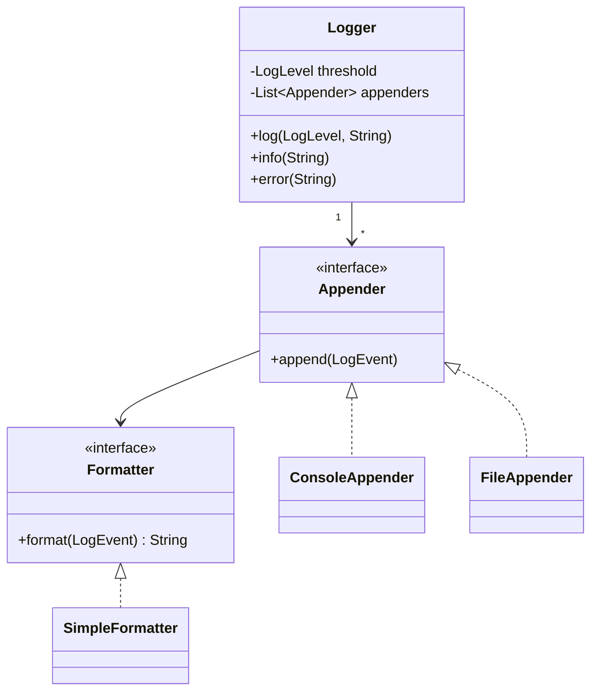

# 🪵 Design a Logging Framework

> Build a flexible logger with levels, multiple output sinks, and pluggable formatting — like Log4j or SLF4J.

---

## 🎯 The Problem

Every application needs logging. A good **logging framework** lets you emit messages at different **severity levels**, send them to multiple destinations (**console, file, network**), and control their format — all configurable without changing application code. It's a clean showcase for the **Strategy** and **Chain of Responsibility** patterns.

---

## 📝 Requirements

- Log levels: **DEBUG, INFO, WARN, ERROR**.
- Only emit messages at or above a configured threshold.
- Support multiple **appenders/sinks** (console, file) per logger.
- Pluggable message **formatting**.

---

## 🧭 Design Approach

- **Strategy pattern** for the output sink (`ConsoleAppender`, `FileAppender`) and for formatting (`Formatter`) — *where* logs go and *how* they look are independent, swappable concerns.
- A level **threshold** filters messages: anything below it is dropped with a cheap comparison.
- (Optionally) **Chain of Responsibility** for level-based handlers, where each handler decides to log or pass the message along.

---

## 🧱 Class Diagram



---

## 💻 Core Code

```java
enum LogLevel {
    DEBUG(1), INFO(2), WARN(3), ERROR(4);
    final int rank;
    LogLevel(int rank) { this.rank = rank; }
}

record LogEvent(LogLevel level, String message, Instant time, String thread) {}

interface Formatter { String format(LogEvent e); }

class SimpleFormatter implements Formatter {
    public String format(LogEvent e) {
        return "%s [%s] %s - %s".formatted(e.time(), e.thread(), e.level(), e.message());
    }
}

interface Appender { void append(LogEvent e); }

class ConsoleAppender implements Appender {
    private final Formatter fmt;
    ConsoleAppender(Formatter fmt) { this.fmt = fmt; }
    public void append(LogEvent e) { System.out.println(fmt.format(e)); }
}

class FileAppender implements Appender {
    private final Formatter fmt;
    private final Path path;
    FileAppender(Formatter fmt, Path path) { this.fmt = fmt; this.path = path; }
    public void append(LogEvent e) {
        try {
            Files.writeString(path, fmt.format(e) + System.lineSeparator(),
                StandardOpenOption.CREATE, StandardOpenOption.APPEND);
        } catch (IOException ex) {
            ex.printStackTrace();
        }
    }
}

class Logger {
    private final LogLevel threshold;
    private final List<Appender> appenders;
    Logger(LogLevel threshold, List<Appender> appenders) {
        this.threshold = threshold;
        this.appenders = appenders;
    }

    void log(LogLevel level, String msg) {
        if (level.rank < threshold.rank) return;   // below threshold -> drop
        LogEvent e = new LogEvent(level, msg, Instant.now(), Thread.currentThread().getName());
        for (Appender a : appenders) a.append(e);
    }

    void debug(String m) { log(LogLevel.DEBUG, m); }
    void info(String m)  { log(LogLevel.INFO, m); }
    void warn(String m)  { log(LogLevel.WARN, m); }
    void error(String m) { log(LogLevel.ERROR, m); }
}
```

---

## ⚖️ Design Decisions

**Appender vs Formatter separation** — *where* a log goes (console, file, network) is orthogonal to *how* it's rendered (plain text, JSON). Two separate Strategy interfaces let you mix and match freely: JSON to a file, plain text to the console.

**Cheap level filtering** — each level has a numeric rank, so the threshold check is a single integer comparison, letting you leave `debug()` calls in production code with negligible cost.

---

## ✅ Contract and non-negotiable behavior

Clarify synchronous/asynchronous mode, structured fields, exception handling, logger hierarchy, dynamic configuration, file rotation, and overload behavior.

- Logging must not recursively log its own failure forever.
- The caller’s application should not normally fail because one sink is unavailable.
- Event time, level, logger name, thread, message template, arguments, exception, and context are captured consistently.
- Sensitive values are redacted before any sink receives them.
- Configuration updates are atomic/versioned; one event uses one configuration snapshot.
- Async mode defines whether each severity blocks, drops, samples, or falls back when the queue is full.

“Negligible cost” applies only when message construction is lazy/parameterized. `logger.debug("value=" + expensive())` evaluates work before filtering; prefer templates/suppliers.

---

## 🧩 Production-minded object model

| Type | Responsibility |
| --- | --- |
| `Logger` | Named API and fast enabled check |
| `LogEventBuilder` | Lazily collect template, arguments, fields, throwable |
| `Filter` | Level/logger/marker/field decisions |
| `Redactor` | Remove/mask secrets and classified fields |
| `Formatter` | Text/JSON serialization with escaping |
| `Appender` | Destination lifecycle and bounded write |
| `AsyncDispatcher` | Queue, worker, overload policy, flush/shutdown |
| `Configuration` | Immutable hierarchy/appenders/filter snapshot |
| `InternalErrorHandler` | Non-recursive fallback diagnostics |

Do not require Chain of Responsibility merely because levels are ordered; one threshold comparison is simpler. Strategy/composition for formatter/appender/filter is enough unless handlers genuinely form a pipeline.

---

## 🔄 Log-event lifecycle

1. `isEnabled(level)` reads immutable logger configuration cheaply.
2. If enabled, capture template/arguments/context/throwable into an immutable event. Avoid formatting on caller thread for async mode.
3. Apply central redaction/classification before enqueue; never rely only on each appender.
4. Sync mode formats/writes with a time budget. Async mode offers to a bounded queue according to severity policy.
5. Worker batches events, formats for each appender, writes, updates success/failure metrics, and isolates a failing sink.
6. Shutdown stops new events, drains until deadline, flushes/rotates/closes sinks, then reports losses.

Structured JSON fields should use a schema/version and correct types. Escape control characters/newlines to prevent log-forging and keep one event parseable. A message template plus arguments preserves structure better than a pre-concatenated string.

---

## 🚦 Backpressure and appender failure

| Situation | Possible policy |
| --- | --- |
| Queue full, DEBUG/INFO | Drop/sample and increment a visible counter |
| Queue full, WARN/ERROR | Bounded block or emergency synchronous fallback |
| File disk full | Circuit-break file appender; use minimal stderr/internal handler |
| Network sink slow | Batch, timeout, retry within bounded memory; spool only with explicit disk limit |
| Formatter throws | Emit safe fallback event without original dangerous value |
| Recursive logging | Thread-local/internal guard stops recursion |

Never use an unbounded queue: a downstream outage would become an application out-of-memory failure. Define at-most-once vs durable/spooled semantics explicitly; a general logging framework is not automatically an audit ledger.

---

## 🔒 Thread safety and file management

Events/configuration are immutable. Async dispatch has one or controlled workers per ordering domain. Appenders document their thread safety. Dynamic configuration swaps an atomic immutable graph and closes retired appenders only after in-flight users finish.

File appender handles size/time rotation, exclusive ownership/locking, retention, compression, permissions, and fsync policy. Use buffered I/O; do not call `Files.writeString(... APPEND)` for every event as a performance design. Audit/security logs may need a separate append-only durable pipeline and stronger access/retention controls.

---

## 🔐 Sensitive-data safety

- Never log passwords, access/refresh tokens, API keys, private keys, session cookies, payment data, or full personal payloads.
- Redact by structured field/classification and safe pattern detection; tests include secret formats. Keep credentials/certificates external to source and validate certificate expiry/strength/issuer through operational tooling.
- Parameterize/escape fields so user newlines/control characters cannot forge records.
- Apply filesystem/network least privilege and TLS for remote sinks; encrypt/spool with managed keys where required.
- Bound field/message length and depth to prevent memory/disk abuse.

---

## 🧪 Test & operations matrix

- Level hierarchy/inheritance and atomic configuration reload.
- Lazy argument not evaluated when disabled.
- Concurrent logging produces complete, non-interleaved events.
- Queue overload behavior by level; loss counter/summary event is visible.
- Appender timeout/disk-full/formatter exception does not recurse or crash caller.
- Redaction and control-character escaping for every sink/format.
- Rotation boundary, retention, shutdown drain/timeout, and worker crash.
- Measure caller latency, queue depth/age, dropped/sampled count, sink latency/error, bytes/events, rotation failure, and last successful flush.

### Interview walkthrough

“A named logger performs a cheap enabled check and creates an immutable structured event. Central filtering/redaction precedes bounded async dispatch; appenders and formatters are independent strategies. Every sink has timeouts and failure isolation, overload policy is explicit by severity, and internal errors use a non-recursive fallback. I distinguish best-effort application logs from a durable audit pipeline.”

### Further reading

- [SLF4J manual and parameterized logging](https://www.slf4j.org/manual.html)
- [Java concurrency utilities](https://docs.oracle.com/en/java/javase/21/core/concurrency.html)

---

## ❓ FAQs

### Why separate the Appender and Formatter?
Because the destination of a log and its format are independent concerns. Separating them (two Strategy interfaces) lets you send JSON-formatted logs to a file while sending plain text to the console — mixing and matching without code duplication.

### How does level filtering work efficiently?
Each level has a numeric rank, and the logger drops any message whose rank is below the configured threshold with a single integer comparison. This makes leaving debug logs in production essentially free.

### How would you make logging high-performance (non-blocking)?
Use asynchronous logging: push `LogEvent`s onto a queue and let a background thread write them out. This way the calling thread never blocks on slow I/O like disk or network writes.

### How would you add a new destination, like sending logs to a network service?
Implement a new `Appender` (e.g., `NetworkAppender`) and add it to the logger's list. No existing code changes — the Strategy design keeps it open for extension.
