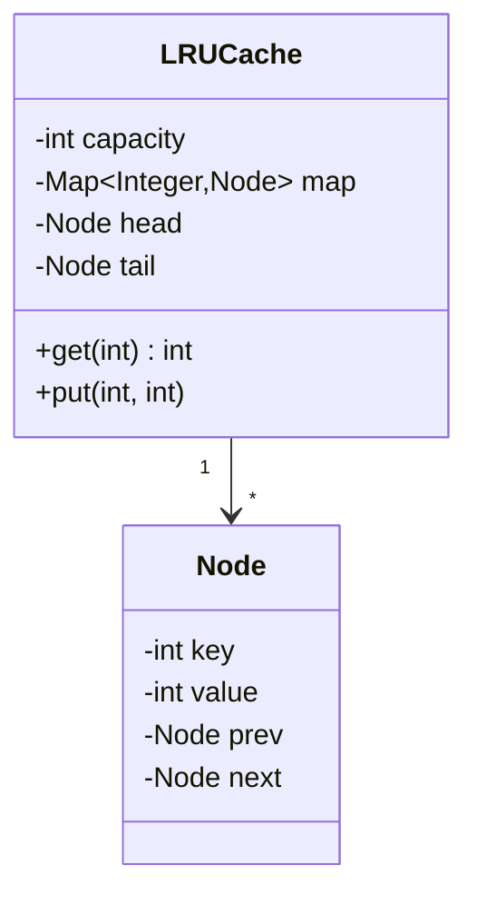

# 🧠 Design an LRU Cache

> Build a fixed-size cache that evicts the **Least Recently Used** item — with O(1) get and put. A favorite that blends data structures with clean design.

---

## 🎯 The Problem

A cache has limited memory, so when it fills up it must throw something out. The **LRU (Least Recently Used)** policy evicts the item that hasn't been touched for the longest time — a great heuristic because recently-used data is likely to be used again. The challenge: make **both** `get` and `put` run in **O(1)**.

---

## 📝 Requirements

- `get(key)` and `put(key, value)`, both in **O(1)** time.
- Fixed capacity; when full, evict the least recently used entry.
- Reading or updating an entry marks it as most recently used.

---

## 🧭 Design Approach

The insight is to combine **two data structures**:

- A **HashMap** — for O(1) lookup of a node by its key.
- A **doubly linked list** — for O(1) reordering: move a node to the front (most recent) and remove from the back (eviction).

The most-recently-used node sits at the **head**; the **tail** is always the next eviction candidate. Sentinel head/tail nodes remove edge-case null checks.

---

## 🧱 Class Diagram



---

## 💻 Core Code

```java
class LRUCache {
    private static class Node {
        int key, value;
        Node prev, next;
        Node(int k, int v) { key = k; value = v; }
    }

    private final int capacity;
    private final Map<Integer, Node> map = new HashMap<>();
    private final Node head = new Node(0, 0); // sentinels
    private final Node tail = new Node(0, 0);

    public LRUCache(int capacity) {
        this.capacity = capacity;
        head.next = tail;
        tail.prev = head;
    }

    public int get(int key) {
        Node node = map.get(key);
        if (node == null) return -1;
        moveToFront(node);          // mark most-recently-used
        return node.value;
    }

    public void put(int key, int value) {
        Node node = map.get(key);
        if (node != null) {
            node.value = value;
            moveToFront(node);
            return;
        }
        if (map.size() == capacity) {
            Node lru = tail.prev;   // evict least-recently-used
            remove(lru);
            map.remove(lru.key);
        }
        Node fresh = new Node(key, value);
        map.put(key, fresh);
        addFront(fresh);
    }

    private void addFront(Node n) {
        n.next = head.next;
        n.prev = head;
        head.next.prev = n;
        head.next = n;
    }
    private void remove(Node n) {
        n.prev.next = n.next;
        n.next.prev = n.prev;
    }
    private void moveToFront(Node n) { remove(n); addFront(n); }
}
```

> Java shortcut: a `LinkedHashMap` with `accessOrder = true` and an overridden `removeEldestEntry` gives you an LRU cache in a few lines — but interviewers usually want the manual version above to prove you understand it.

---

## ⚖️ Design Decisions

**Why a doubly linked list?** Eviction removes the tail, and any accessed node must move to the front. With a *doubly* linked list you have each node's `prev`, so removing it and relinking neighbors is O(1). A singly linked list would need an O(n) scan to find the previous node.

**Why sentinel nodes?** Dummy head and tail nodes mean the list is never empty, so insert/remove never has to special-case null — the logic stays simple and bug-free.

---

## ✅ Contract and invariants

Clarify capacity semantics, null support, eviction listener, TTL, weight vs entry count, and concurrency. A clean generic core can expose:

```java
interface Cache<K, V> {
    Optional<V> get(K key);
    void put(K key, V value);
    Optional<V> remove(K key);
    int size();
}
```

**Structural invariants**

- `0 ≤ map.size() ≤ capacity` and map size equals the number of real list nodes.
- Every map entry points to exactly one node linked between sentinels.
- Every real node is reachable exactly once from head and tail.
- `head.next` is MRU; `tail.prev` is LRU.
- `prev/next` links are reciprocal; sentinels are never map values or evicted.
- `capacity` is positive (or zero behavior is explicitly defined).

Returning `Optional<V>` avoids confusing a cached null with a miss. Do not use a magic `-1` for a generic cache.

---

## 🔄 Operation walkthrough

| Operation | Map work | List work | Result |
| --- | --- | --- | --- |
| `get(k)` hit | Find node | Unlink + insert MRU | value |
| `get(k)` miss | No node | none | empty |
| `put(k,v)` existing | Find/update | move MRU | no eviction |
| `put(k,v)` new, space | Insert | insert MRU | no eviction |
| `put(k,v)` new, full | Insert | remove LRU + insert MRU | one eviction |
| `remove(k)` | Remove node | unlink | previous value |

Notice `get` is logically a write because it changes recency. This matters for lock selection and makes a simple read/write lock less helpful than it first appears.

---

## 🔒 Thread-safety choices

The shown implementation is not thread-safe. The simplest correct version wraps **every** structure-changing operation (`get`, `put`, `remove`) in one `ReentrantLock` and uses `try/finally`:

```java
lock.lock();
try {
    // map + linked-list operation is one atomic invariant-preserving step
} finally {
    lock.unlock();
}
```

Never use `ConcurrentHashMap` alone while leaving the linked list unprotected: the two structures can diverge. `synchronized` is also a valid, simpler interview choice. Segmentation/striping improves throughput but approximates global LRU per segment; production caches often use buffered admission/recency rather than moving one shared list node on every read.

Eviction callbacks must run after releasing the structural lock or be strictly bounded; arbitrary callback code under the lock can deadlock/re-enter the cache.

---

## ⏳ TTL, loading and stampede extensions

TTL adds `expiresAt` per node plus an injected monotonic clock. On `get`, an expired entry is a miss and removed. Lazy expiration is simple; a background expiry heap/timing wheel reclaims idle expired entries. TTL and LRU are independent: expiration removes invalid data, LRU manages capacity.

A loading cache adds `get(key, loader)`. Coalesce concurrent loads for one key with an in-flight future so 100 misses do not call the database 100 times. Define whether failures are cached briefly and never hold the global cache lock while running user loaders.

Weighted capacity replaces `size()` with total weight and may evict multiple LRU nodes per insert. Reject an item whose individual weight exceeds capacity.

---

## 🧪 Verification plan

- Capacity 1, update existing, repeated get, remove missing, and exact eviction order.
- Alternating accesses that change which key is LRU.
- Zero/negative capacity constructor behavior and null policy.
- Map/list invariant checker after every randomized operation; compare against a slow reference model.
- Concurrent get/put/remove stress under the chosen lock; run with race/deadlock diagnostics.
- TTL exactly before/at/after expiry using a fake ticker—no sleeps.
- Eviction callback exception/re-entry cannot corrupt the cache.

Complexity remains average O(1) for map + node operations, O(capacity) space. Hash-map O(1) depends on a reasonable hash function; eviction listeners/loaders add their own cost outside the core bound.

---

## 🌱 Alternatives and interview summary

Java’s access-ordered `LinkedHashMap` already maintains least-to-most recent encounter order and supports eldest removal, which is ideal in application code but may hide the data-structure reasoning an interviewer wants. LFU needs frequency buckets; FIFO does not move on read; Caffeine-like production policies add admission and concurrency techniques.

“The cache owns a hash map for O(1) lookup and one doubly linked list for O(1) recency/eviction. I state map/list invariants, treat `get` as a mutation, and use one lock for correctness before discussing segmented approximation. TTL, loaders, weight, and callbacks are separate policies with explicit timing and reentrancy behavior.”

### Further reading

- [Java `LinkedHashMap` access-order and eldest-entry behavior](https://docs.oracle.com/en/java/javase/21/docs/api/java.base/java/util/LinkedHashMap.html)
- [Java `ReentrantLock`](https://docs.oracle.com/en/java/javase/21/docs/api/java.base/java/util/concurrent/locks/ReentrantLock.html)

---

## ❓ FAQs

### Why combine a hash map and a linked list?
The hash map gives O(1) key lookup, and the doubly linked list gives O(1) reordering (move-to-front) and O(1) eviction (remove tail). Neither structure alone can do both operations in constant time.

### Why a doubly linked list instead of a singly linked one?
Because you must remove an arbitrary node (the one just accessed) in O(1). A doubly linked node knows its predecessor, so you can unlink it instantly; a singly linked list would require scanning to find the previous node.

### What are the sentinel head/tail nodes for?
They're dummy boundary nodes so the list is never truly empty. This eliminates null checks when inserting at the front or removing at the back, keeping the pointer logic clean.

### How would you make the cache thread-safe?
Guard `get`/`put` with a lock, or use a striped/segmented design to reduce contention. Note a single global lock serializes all access; concurrent caches like Caffeine use more advanced techniques.
