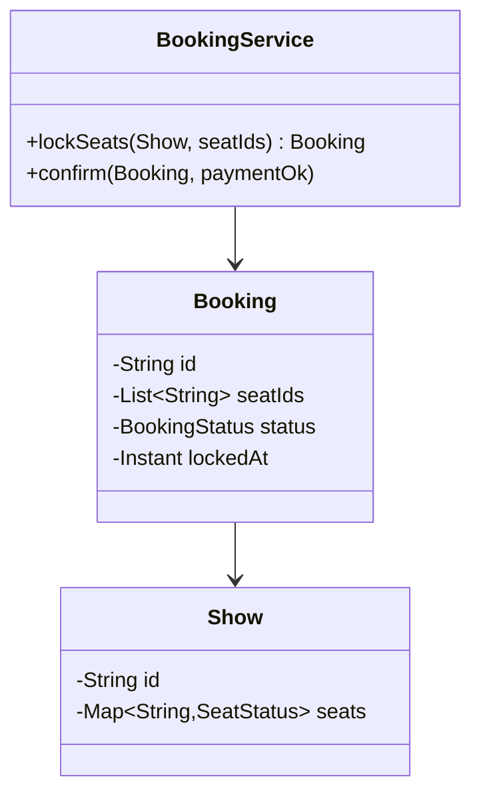

# 🎟️ Design a Movie Ticket Booking System (BookMyShow)

> Browse shows, pick seats, and book tickets — where the hard part is **concurrent seat locking** so no seat is ever double-booked.

---

## 🎯 The Problem

**BookMyShow** lets users browse movies and showtimes, view a seat map, select seats, and pay. The defining challenge is **concurrency**: when a popular show goes on sale, thousands of users try to grab the same seats at once. The system must guarantee that **two people can never book the same seat** — while still holding seats briefly during checkout.

---

## 📝 Requirements

- Browse movies, theaters, and showtimes.
- View a seat map and select available seats.
- Book seats and pay; **no double-booking**, ever.
- Temporarily hold selected seats during checkout, releasing them if payment doesn't complete.

---

## 🧭 Design Approach

- Model `Movie → Show → Seat`, with per-show seat state.
- **Seat locking** with a short **TTL** prevents double-booking while a user pays, and auto-releases if they abandon checkout.
- **State pattern** for a booking's lifecycle: `Created → SeatsLocked → Confirmed / Expired`.

---

## 🧱 Class Diagram



---

## 💻 Core Code

```java
enum SeatStatus { AVAILABLE, LOCKED, BOOKED }
enum BookingStatus { CREATED, SEATS_LOCKED, CONFIRMED, EXPIRED }

class Show {
    final String id;
    final Map<String, SeatStatus> seats = new ConcurrentHashMap<>();
    Show(String id, List<String> seatIds) {
        this.id = id;
        seatIds.forEach(s -> seats.put(s, SeatStatus.AVAILABLE));
    }
}

class Booking {
    final String id = UUID.randomUUID().toString();
    final Show show;
    final List<String> seatIds;
    BookingStatus status = BookingStatus.CREATED;
    final Instant lockedAt = Instant.now();
    Booking(Show show, List<String> seatIds) { this.show = show; this.seatIds = seatIds; }
}

class BookingService {
    private static final Duration LOCK_TTL = Duration.ofMinutes(5);

    // Atomically lock all requested seats, or fail if any is taken.
    synchronized Booking lockSeats(Show show, List<String> seatIds) {
        for (String s : seatIds)
            if (show.seats.get(s) != SeatStatus.AVAILABLE)
                throw new IllegalStateException("Seat " + s + " unavailable");
        seatIds.forEach(s -> show.seats.put(s, SeatStatus.LOCKED));
        Booking b = new Booking(show, seatIds);
        b.status = BookingStatus.SEATS_LOCKED;
        return b;
    }

    void confirm(Booking b, boolean paymentOk) {
        if (Duration.between(b.lockedAt, Instant.now()).compareTo(LOCK_TTL) > 0) {
            release(b);
            b.status = BookingStatus.EXPIRED;
            throw new IllegalStateException("Lock expired, seats released");
        }
        if (!paymentOk) {
            release(b);
            throw new IllegalStateException("Payment failed");
        }
        b.seatIds.forEach(s -> b.show.seats.put(s, SeatStatus.BOOKED));
        b.status = BookingStatus.CONFIRMED;
    }

    private void release(Booking b) {
        b.seatIds.forEach(s -> b.show.seats.put(s, SeatStatus.AVAILABLE));
    }
}
```

---

## ⚖️ Design Decisions

**Atomic seat locking** — the `lockSeats` step checks and marks all requested seats in one indivisible operation. Only one request can flip a seat from `AVAILABLE` to `LOCKED`, so concurrent buyers can't grab the same seat.

**Time-bounded holds** — locking with a **TTL** means abandoned checkouts don't freeze seats forever. If payment isn't completed within (say) 5 minutes, the seats auto-release for others.

**State lifecycle** — modeling the booking's states makes illegal transitions (e.g., confirming an expired booking) explicit and easy to guard.

---

## ✅ Invariants and complete scope

Core use cases are browse movie/theater/show, view a seat map, hold seats, price a booking, pay, confirm/cancel/expire, and issue tickets. Catalog search, recommendations, concessions, refunds, and external payment internals are optional dependencies.

- A `(showId, seatId)` has at most one active hold and at most one confirmed booking.
- A hold has one owner/session, an absolute expiry, and a server-issued token/version.
- All seats in one booking are held atomically—or none are.
- Confirmation succeeds once only when the caller owns an unexpired hold and payment outcome is acceptable.
- Price, taxes, fees, currency, and policy/version are frozen when checkout begins.
- Payment retries and booking retries have stable idempotency keys.

Do not store per-show state inside one mutable `Show.seats` map for a deployed service. `Seat` describes theater geometry; `ShowSeat` is inventory for one show.

---

## 🧩 Domain model and states

| Type | Responsibility |
| --- | --- |
| `Movie`, `Theater`, `Auditorium`, `Seat` | Catalog and physical layout |
| `Show` | Movie + auditorium + start/end + sales window |
| `ShowSeat` | Per-show seat, category, current price ref, inventory state/version |
| `SeatHold` | Owner, show, seat set, expiry, state/token |
| `Booking` | Customer, price snapshot, state, tickets, payment ref |
| `PricingStrategy` | Deterministic price breakdown from show/seat/policy |
| `InventoryRepository` | Atomic hold/confirm/release boundary |
| `PaymentPort` | Idempotent authorize/capture/refund integration |

```text
ShowSeat: AVAILABLE → HELD → BOOKED
                    └────→ AVAILABLE (expiry/cancel)
SeatHold: ACTIVE → CONSUMED | EXPIRED | CANCELLED
Booking: PENDING_PAYMENT → CONFIRMED → CANCELLED | REFUND_PENDING → REFUNDED
```

Keep hold state and booking state separate: a user can hold seats before a booking/payment record exists, and an expired hold is not a failed payment.

---

## 📜 Service contracts

```text
holdSeats(showId, seatIds, customerId, requestId) -> Hold(id, token, expiresAt, quote)
confirmBooking(holdId, holdToken, paymentMethodToken, requestId) -> Booking
cancelBooking(bookingId, expectedVersion, requestId) -> Cancellation
getSeatMap(showId, sinceVersion?) -> SeatMapSnapshot
```

Reject duplicate seat IDs, seats from different shows, holds after sales close, invalid quantities, and client-computed prices. The hold token is unguessable and bound to owner/show/seat set/expiry; do not expose raw database lock identifiers.

---

## 🔄 Hold and confirmation flows

**Hold seats**

1. Authenticate customer, validate show sales window and normalized sorted seat IDs.
2. Compute quote and snapshot its pricing/tax version.
3. Begin transaction, lock candidate `ShowSeat` rows in stable seat-ID order (or perform conditional updates).
4. Verify all are `AVAILABLE` or reclaimably expired; if any fails, roll back the whole set.
5. Create `SeatHold(ACTIVE, expiresAt)` and set every row `HELD` with `holdId/expiry/version`.
6. Commit and publish an availability update through an outbox.

**Confirm**

1. Claim confirmation idempotency and validate owner/token/expiry.
2. Create one payment intent using a stable booking/hold key. Provider timeout becomes `UNKNOWN/PROCESSING`, not immediate seat release.
3. When payment is authorized/captured, transactionally lock the hold and seats, recheck ownership/expiry/state, set seats `BOOKED`, hold `CONSUMED`, booking `CONFIRMED`, and create tickets.
4. Commit then publish tickets/notifications.

The product must decide what happens if payment completes milliseconds after hold expiry. A common approach reserves a short internal confirmation grace once payment starts, while preventing indefinite user-visible holds.

---

## 🔒 Multi-server concurrency choices

The relational database can be the authoritative coordinator using `SELECT ... FOR UPDATE`, conditional version updates, and a uniqueness constraint on confirmed `(show_id, seat_id)`. It keeps inventory and booking commit in one ACID boundary.

Redis `SET NX PX` can accelerate holds but **TTL alone is not sufficient** for safe release: an old owner must not delete a newer owner’s lock. Release/extend with a compare-token atomic script, and still enforce booking uniqueness durably. Cache seat maps as projections; stale availability may cause a hold conflict but never double booking.

Lock multiple seats in sorted order to reduce deadlocks. On serialization/deadlock failure, retry the entire bounded transaction with jitter. Do not hold database transactions open while calling the payment provider.

---

## 🧯 Failure and compensation matrix

| Scenario | Safe behavior |
| --- | --- |
| Client retries hold | Return same hold for same request/payload |
| One of several seats unavailable | Atomic rollback; return conflicts, hold none |
| Payment provider times out | Keep processing/grace; query provider by idempotency key |
| Payment succeeds but booking commit conflicts/fails | Reconcile immediately; retry commit if ownership valid, otherwise refund/void idempotently |
| Expiry worker repeats | Conditional `ACTIVE + expiresAt` transition; release only rows still owned by hold |
| Availability event duplicates | Consumers apply show/seat version idempotently |
| Service crashes after commit | Outbox publishes confirmation/tickets on restart |

Schedulers are optimizations; correctness cannot depend on a timer firing exactly at expiry. Every read/write treats an expired `HELD` row as reclaimable only through an atomic transition.

---

## 🔐 Security, privacy & operations

- Object-level authorization for holds/bookings/tickets; high-entropy IDs/tokens; rate limits on seat-map polling and hold churn.
- Never store/log raw payment credentials. Use PSP tokens, managed secrets, TLS, and verified webhooks.
- Sign ticket QR payloads with a rotatable managed key and include booking/ticket ID, show, expiry/audience—no unnecessary personal data.
- Audit staff overrides/refunds; protect customer contact/payment/attendance history with retention and access controls.
- Monitor hold success/conflict, hold age/expiry/release lag, seat-map staleness, transaction retry/deadlock, payment unknown age, booking conversion, compensation/refund failures, outbox lag, and invariant checks for duplicate booking.

---

## 🧪 Test matrix and interview summary

- One seat/last seat, atomic multi-seat all-or-none, duplicate seat list.
- 100 concurrent holds for one seat yield one active owner.
- Expiry boundary with fake clock; old token cannot release/reconfirm a new hold.
- Duplicate hold/confirm/payment callback; same result and one booking/ticket set.
- Price changes after hold retain quote; sales close/timezone boundaries.
- Payment timeout, late success, booking commit failure, idempotent refund.
- DB deadlock/serialization retry and outbox recovery.

“I model physical seats separately from per-show inventory. Holding a sorted seat set is one conditional database transaction with owner token, absolute expiry, and price snapshot. Payment happens outside the inventory transaction with a stable idempotency key; confirmation then atomically consumes the hold, books seats, and creates tickets. Redis may accelerate availability, but database constraints remain the no-double-booking guarantee.”

### Further reading

- [PostgreSQL explicit row locking](https://www.postgresql.org/docs/current/explicit-locking.html)
- [PostgreSQL transaction isolation and retries](https://www.postgresql.org/docs/current/transaction-iso.html)
- [Stripe idempotent requests](https://docs.stripe.com/api/idempotent_requests)

---

## ❓ FAQs

### How do you prevent two people from booking the same seat?
Lock seats atomically before payment. The check-and-mark step is indivisible, so only the first request can move a seat from AVAILABLE to LOCKED; any concurrent request for that seat fails immediately.

### Why lock seats with a TTL instead of until payment finishes?
Because users abandon checkouts. A time-bounded hold (e.g., 5 minutes) means seats automatically free up if payment isn't completed, balancing a good buyer experience against keeping seats available.

### How does this work across multiple servers, not just one JVM?
Use a shared authoritative transaction: conditional updates or `SELECT ... FOR UPDATE` on per-show seat rows, plus a uniqueness constraint on confirmed seats. Redis `SET NX PX` can accelerate temporary holds, but release/extend must compare the owner token atomically and the database must still prevent double booking.

### What happens if payment fails or times out?
The `confirm` step releases the locked seats back to AVAILABLE and marks the booking FAILED/EXPIRED, so the seats immediately become bookable again by others.
