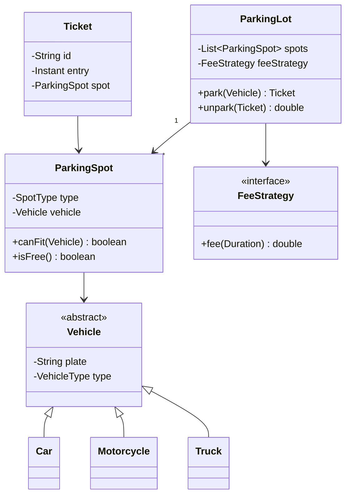

# 🅿️ Design a Parking Lot

> The classic OOP interview question — model a multi-level parking lot with different vehicle and spot sizes, tickets, and fees.

---

## 🎯 The Problem

Model the software behind a parking garage: cars enter, get assigned a spot that fits, receive a ticket, and pay based on how long they stayed. It's a favorite interview question because it exercises **enums, inheritance, composition, and the Strategy pattern** in a small, relatable domain.

---

## 📝 Requirements

- Multiple levels, each with many spots.
- Spot sizes: **Motorcycle**, **Compact**, **Large**.
- A vehicle fits certain spot sizes; park it in the nearest available fitting spot.
- Issue a ticket on entry; compute a fee on exit.
- Reject entry when the lot is full.

---

## 🧭 Design Approach

- **Enums** (`VehicleType`, `SpotType`) model the fixed categories cleanly.
- **Inheritance** — an abstract `Vehicle` with `Car`, `Motorcycle`, `Truck` subtypes.
- **Composition** — a `ParkingLot` *has* spots; a `Ticket` *has* a spot.
- **Strategy pattern** for pricing (`FeeStrategy`) so rates change independently of parking logic.

Reaching for Strategy here follows the **Open/Closed principle**: you can add a new pricing scheme without touching the `ParkingLot` class.

---

## 🧱 Class Diagram



---

## 💻 Core Code

```java
enum VehicleType { MOTORCYCLE, CAR, TRUCK }
enum SpotType { MOTORCYCLE, COMPACT, LARGE }

abstract class Vehicle {
    final String plate;
    final VehicleType type;
    Vehicle(String plate, VehicleType type) { this.plate = plate; this.type = type; }
}
class Car extends Vehicle { Car(String p) { super(p, VehicleType.CAR); } }
class Motorcycle extends Vehicle { Motorcycle(String p) { super(p, VehicleType.MOTORCYCLE); } }
class Truck extends Vehicle { Truck(String p) { super(p, VehicleType.TRUCK); } }

class ParkingSpot {
    final SpotType type;
    private Vehicle vehicle;
    ParkingSpot(SpotType type) { this.type = type; }

    boolean isFree() { return vehicle == null; }

    boolean canFit(Vehicle v) {
        return switch (v.type) {
            case MOTORCYCLE -> true;
            case CAR        -> type == SpotType.COMPACT || type == SpotType.LARGE;
            case TRUCK      -> type == SpotType.LARGE;
        };
    }
    void park(Vehicle v) { this.vehicle = v; }
    void free() { this.vehicle = null; }
}

interface FeeStrategy { double fee(Duration parked); }

class HourlyFee implements FeeStrategy {
    public double fee(Duration d) {
        return Math.max(1, Math.ceil(d.toHours())) * 2.0; // $2/hour, min 1 hour
    }
}

class Ticket {
    final String id = UUID.randomUUID().toString();
    final Instant entry = Instant.now();
    final ParkingSpot spot;
    Ticket(ParkingSpot spot) { this.spot = spot; }
}

class ParkingLot {
    private final List<ParkingSpot> spots;
    private final FeeStrategy feeStrategy;
    ParkingLot(List<ParkingSpot> spots, FeeStrategy feeStrategy) {
        this.spots = spots;
        this.feeStrategy = feeStrategy;
    }

    Ticket park(Vehicle v) {
        ParkingSpot spot = spots.stream()
            .filter(s -> s.isFree() && s.canFit(v))
            .findFirst()
            .orElseThrow(() -> new IllegalStateException("Lot full"));
        spot.park(v);
        return new Ticket(spot);
    }

    double unpark(Ticket t) {
        t.spot.free();
        return feeStrategy.fee(Duration.between(t.entry, Instant.now()));
    }
}
```

---

## ⚖️ Design Decisions

**Why Strategy for fees?** Pricing changes often — hourly, flat daily, weekend rates, dynamic surge. Isolating it behind `FeeStrategy` means new schemes plug in without editing parking logic.

**Making spot search fast** — the linear `stream().filter()` is O(n). At scale, keep a per-`SpotType` free list (a queue of open spots) so finding a spot is O(1).

---

## ✅ Invariants and use cases

Before classes, state what must always be true:

- One active ticket belongs to one vehicle and one occupied spot.
- A spot has at most one active vehicle; a vehicle has at most one active ticket.
- Spot assignment follows the configured fit and allocation policies.
- Exit closes the ticket and frees the spot exactly once.
- Money is represented in minor units/`BigDecimal`, never `double` in production code.

Primary use cases are `enter(vehicle, gate)`, `findSpot(vehicle)`, `pay(ticket, method)`, `exit(ticket, gate)`, plus admin actions for floors/spots/rates and display boards. Reservations, valet, monthly passes, lost-ticket policy, EV charging, and multi-garage search are optional extensions—clarify them before modeling.

---

## 🧩 Responsibility map

| Type | Responsibility | Must not own |
| --- | --- | --- |
| `ParkingLot` | Aggregate/facade, floors, gates, policy wiring | Pricing arithmetic or payment gateway details |
| `SpotAssignmentStrategy` | Select a fitting available spot | Mutate ticket/payment state |
| `ParkingSpot` | Spot identity/type and occupancy invariant | Search the lot |
| `ParkingTicket` | Entry time, vehicle/spot, lifecycle/version | Global spot inventory |
| `FeeStrategy` | Deterministic fee from ticket/rate context | Close tickets or charge cards |
| `PaymentService` | Idempotent payment attempt | Decide parking duration |
| `AvailabilityIndex` | Fast free-spot lookup/counters | Authoritative occupancy without coordination |

Prefer composition over the sample’s vehicle inheritance when subtypes carry no unique behavior: an immutable `Vehicle(plate, VehicleType)` is often enough. Strategy is justified for policies that truly vary; do not create one interface per one-line method merely to name a pattern.

---

## 🔄 Entry and exit sequences

**Entry**

1. Normalize/validate plate and vehicle type; reject an existing active ticket.
2. Ask `SpotAssignmentStrategy` for candidates, usually smallest fitting type then nearest walking/entry distance.
3. Atomically reserve one candidate (`FREE → HELD`) with ticket request ID and short lease.
4. Create the ticket and change the spot to `OCCUPIED` in one transaction/critical section.
5. Update display-board projections and open the gate only after durable success.

**Exit**

1. Load active ticket, calculate duration using an injected `Clock`, and snapshot the applicable rate-plan version.
2. Compute an itemized fee using exact decimal/minor units.
3. Create/return an idempotent payment result. A timeout must not start a second charge blindly.
4. Atomically mark ticket `CLOSED` and spot `FREE`; publish an availability event.
5. Open the gate. If hardware acknowledgement fails, the ticket remains closed and an operator workflow handles the gate—not a second payment.

```text
Spot:   FREE → HELD → OCCUPIED → OUT_OF_SERVICE
                   └──────────→ FREE
Ticket: ACTIVE → PAYMENT_PENDING → PAID → CLOSED
             └────────────────→ LOST/CANCELLED (policy-controlled)
```

---

## 🔒 Concurrency and persistence

The sample is intentionally in-memory. In one JVM, guard selection + occupation with a lock and always release in `finally`. In a real multi-gate deployment, use the database as coordinator:

```sql
UPDATE parking_spot
SET status = 'HELD', hold_id = :requestId, hold_expires_at = :expiresAt
WHERE spot_id = :spotId AND status = 'FREE';
```

Proceed only when one row changed. Add a uniqueness constraint on active ticket per plate and spot. Expired-hold cleanup uses the same conditional version/state checks, so it cannot free an already occupied spot.

Availability free lists are projections: remove a candidate optimistically, but the conditional write is authoritative. If the index is stale, discard that candidate and try the next. Lock multiple resources in a stable order to avoid deadlocks.

---

## 🧪 Test matrix

| Area | Cases |
| --- | --- |
| Fit | Motorcycle in every allowed spot; car not motorcycle-only; truck large-only |
| Allocation | Nearest/smallest fitting spot; skip held/out-of-service candidates |
| Capacity | Exact last spot, full lot, release makes capacity visible |
| Time/fees | Boundary minute/hour, overnight, grace period, max daily rate, timezone/DST |
| Idempotency | Duplicate entry request, duplicate payment callback, duplicate exit scan |
| Concurrency | 100 entry requests for one spot produce exactly one ticket |
| Failure | Ticket write fails after hold; payment succeeds but gate hardware fails |

Inject `Clock`, `SpotAssignmentStrategy`, `FeeStrategy`, and payment/gate ports. Unit-test policies; integration-test transactional invariants; stress-test the race.

---

## 🌱 Extensions and trade-offs

- Add `Reservation` as a separate expiring claim, not a boolean on `ParkingSpot`.
- EV charging is a session with metering/pricing; it should reference a spot, not turn every spot into a charger subtype.
- Display boards consume availability events and may be briefly stale; the allocation transaction remains authoritative.
- For multiple garages, keep each garage aggregate local and query a read model; a single global lock is unnecessary.

### Interview walkthrough

“I begin with fit, ticket, occupancy, and payment invariants. `ParkingLot` coordinates pluggable assignment and fee policies. Entry conditionally claims a spot and creates a ticket atomically; exit makes payment idempotent, closes once, and frees once. Fast free lists are projections, while a row version/conditional update prevents two gates assigning the same spot.”

### Further reading

- [Java `Clock` for deterministic time-based tests](https://docs.oracle.com/en/java/javase/21/docs/api/java.base/java/time/Clock.html)
- [PostgreSQL explicit row locking](https://www.postgresql.org/docs/current/explicit-locking.html)
- [Java `BigDecimal` exact decimal arithmetic](https://docs.oracle.com/en/java/javase/21/docs/api/java.base/java/math/BigDecimal.html)

---

## ❓ FAQs

### Why use the Strategy pattern for fee calculation?
Because pricing rules change frequently and independently of parking logic. Putting fee calculation behind a `FeeStrategy` interface lets you add hourly, flat, or dynamic pricing without modifying the `ParkingLot` class — that's the Open/Closed principle in action.

### How would you make finding an available spot fast?
Instead of scanning all spots (O(n)), maintain a separate free-list or counter per spot type. Assigning a spot then becomes an O(1) pop from the right list, and freeing pushes it back.

### How do you make the lot thread-safe for concurrent entries?
Synchronize the find-and-occupy step (or use an atomic reservation). Without it, two cars could be assigned the same spot in a race. Only the critical "select and mark occupied" section needs locking.

### How would you support different vehicle-to-spot fit rules?
The `canFit` method encapsulates those rules per spot. Adding a new vehicle type or fit rule is a localized change there, keeping the rest of the system untouched.
