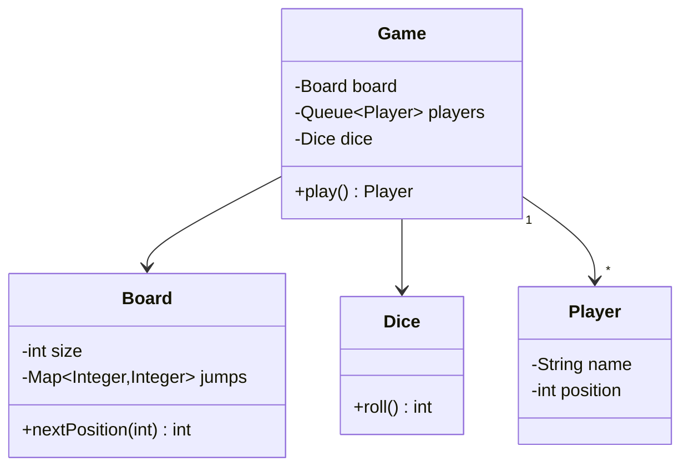

# 🐍 Design Snake & Ladder

> A dice game modeled with clean OOP — board, snakes, ladders, players, and turns.

---

## 🎯 The Problem

Model the **Snake & Ladder** board game: players roll a die and move along numbered cells; landing on a ladder's base jumps you up, landing on a snake's head slides you down, and the first to reach the final cell wins. It's a compact problem that rewards a clean, uniform model of the board's special cells.

---

## 📝 Requirements

- An N×N board (usually 100 cells) with snakes and ladders.
- Multiple players roll a die and move in turn.
- Snakes send a player down; ladders send a player up.
- The first player to land exactly on the final cell wins.

---

## 🧭 Design Approach

- **Model snakes and ladders uniformly** as *jumps* (`start → end`). A ladder jumps up (`end > start`), a snake jumps down (`end < start`). This removes duplicated logic — only the direction differs.
- A `Game` loop rotates players via a queue.
- The `Dice` is its own object so it can be injected/mocked for deterministic tests.

---

## 🧱 Class Diagram



---

## 💻 Core Code

```java
class Dice {
    private final Random rnd = new Random();
    int roll() { return rnd.nextInt(6) + 1; }
}

class Board {
    final int size;                                    // e.g. 100
    private final Map<Integer, Integer> jumps = new HashMap<>(); // start -> end

    Board(int size) { this.size = size; }

    void addSnake(int head, int tail)   { jumps.put(head, tail); }   // tail < head
    void addLadder(int bottom, int top) { jumps.put(bottom, top); }  // top > bottom

    // Apply a snake or ladder if one starts here.
    int nextPosition(int pos) {
        return jumps.getOrDefault(pos, pos);
    }
}

class Player {
    final String name;
    int position = 0;
    Player(String name) { this.name = name; }
}

class Game {
    private final Board board;
    private final Deque<Player> players = new ArrayDeque<>();
    private final Dice dice = new Dice();

    Game(Board board, List<Player> players) {
        this.board = board;
        this.players.addAll(players);
    }

    Player play() {
        while (true) {
            Player p = players.pollFirst();
            int roll = dice.roll();
            int target = p.position + roll;

            if (target <= board.size) {
                p.position = board.nextPosition(target); // apply snake/ladder
                if (p.position == board.size) return p;  // winner
            }
            // if target > size, player stays (must land exactly)
            players.addLast(p); // next player's turn
        }
    }
}
```

---

## ⚖️ Design Decisions

**Uniform jumps** — treating both snakes and ladders as a `start → end` mapping means the movement logic is a single map lookup, regardless of whether it's a snake or a ladder. Cleaner and less error-prone than two separate structures.

**Injectable dice** — passing in the `Dice` (or a roll supplier) lets tests feed deterministic rolls, making the game logic verifiable.

---

## ✅ Rules and invariants

Clarify the rules because variants change the design: exact finish vs bounce/no-move, extra turn on six, multiple dice, chained jumps, collisions/captures, maximum turns, and cyclic jumps.

- Board cells are within `[1, size]`; players begin at a defined off-board/start position.
- Every jump endpoint is valid, a start has at most one effect, and the configuration cannot create an infinite effect cycle unless cycles are deliberately supported.
- Exactly one active player owns a turn.
- One accepted roll creates one immutable `TurnResult` and at most one position update.
- Once a winner exists, no more turns are accepted.

Validate snakes (`end < start`) and ladders (`end > start`) in the named methods—the sample currently accepts invalid direction because both just call `put`.

---

## 🧩 Responsibility map

| Type | Responsibility |
| --- | --- |
| `Game` | Turn lifecycle, players, terminal state, rules orchestration |
| `Board` | Size and immutable cell-effect configuration |
| `CellEffect` | Transform position/context (`Jump`, `Skip`, `ExtraTurn`) |
| `Dice` | Produce roll value; interface for testability |
| `MovementRule` | Overshoot/exact/bounce behavior |
| `TurnRule` | Rotation, extra turn, skip, max-turn logic |
| `TurnResult` | Immutable roll, start, provisional/final position, effects, next player |

Prefer injecting `Dice` and rules through the constructor. `Game.play()` as an infinite loop is fine for a console demo but difficult for UI/testing; expose `takeTurn()` so a caller drives one bounded action.

---

## 🔄 One-turn sequence

1. Reject if the game is terminal; capture active player and turn number.
2. Roll through injected `Dice`; validate result is within its declared range.
3. Apply `MovementRule` to current position + roll.
4. Resolve cell effects. If chaining is enabled, track visited cells and cap depth to prevent loops.
5. Apply collision rule if any, set player position, and evaluate win.
6. Create `TurnResult`, append event, then choose same/next player through `TurnRule`.

```java
record TurnResult(
    int turnNumber, String playerId, int roll,
    int start, int landed, int finalPosition,
    List<String> effects, boolean won
) {}
```

This result lets a UI animate “rolled 4 → landed 28 → snake to 12” without reconstructing hidden logic.

---

## 🔒 Persistence and concurrency

Local play should serialize calls naturally. Online play uses `game.version` optimistic concurrency and idempotent `turnId`; only the active player with the expected version can commit. Persist the turn event and snapshot atomically, then broadcast.

Randomness for a casual game can use `java.util.random.RandomGenerator`; security-grade randomness is unnecessary unless rolls have money/prizes. For auditable competitive games, a trusted server generates rolls and records enough seed/commit-reveal evidence under an explicit fairness protocol—do not let clients send their own roll.

---

## 🧪 Test matrix

- Normal move, ladder, snake, chained effect on/off.
- Exact finish, overshoot behavior, first/last cells.
- Invalid/cyclic board configuration and duplicate jump start.
- Deterministic roll sequence, dice min/max, extra-turn rule.
- Winner terminal behavior and draw/max-turn policy.
- Two simultaneous online turns produce one success; repeated `turnId` is stable.
- Property tests: every position stays in range; turn order follows rules; terminal state is absorbing.

### Extensions and interview summary

“I model the board as validated immutable cell effects, inject dice/movement/turn rules, and expose one bounded `takeTurn()` returning a rich immutable result. The game owns turn and terminal invariants; online play uses server-generated rolls, idempotent turn IDs, and optimistic versioning before broadcasting.”

### Further reading

- [Java random-number generator interfaces](https://docs.oracle.com/en/java/javase/21/docs/api/java.base/java/util/random/RandomGenerator.html)
- [PostgreSQL transaction isolation](https://www.postgresql.org/docs/current/transaction-iso.html)

---

## ❓ FAQs

### Why model snakes and ladders the same way?
Both are just position mappings — land on cell X, move to cell Y. Unifying them as `start → end` jumps removes duplicate code; the only difference is whether the destination is higher (ladder) or lower (snake).

### Why must a player land exactly on the final cell?
It's a common rule variant: if the roll would overshoot the last cell, the player forfeits the turn and stays put. It's enforced with a single bounds check in the play loop.

### How would you make the dice testable?
Inject the `Dice` object (or a `roll()` supplier) into the game instead of hard-coding randomness. Tests can then provide fixed sequences of rolls to verify specific scenarios deterministically.

### How would you support special cells with custom effects?
Generalize `jumps` into a map of cell → effect (a small `CellEffect` interface). A snake, ladder, "roll again", or "skip a turn" all become interchangeable effects applied in `nextPosition`.
