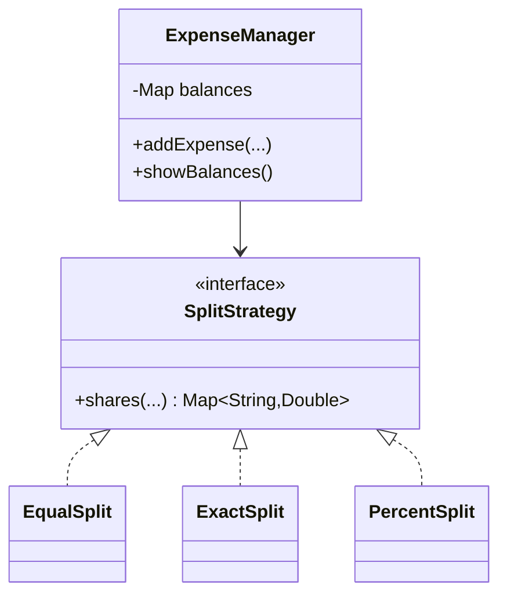

# 💸 Design Splitwise (Expense Sharing)

> Track who paid, split expenses among a group, and settle balances — the model behind Splitwise.

---

## 🎯 The Problem

**Splitwise** lets a group log shared expenses ("I paid $60 for dinner, split 3 ways") and tracks who owes whom, so everyone can settle up later. The interesting parts are supporting **different split types** cleanly and computing **balances** efficiently — a natural fit for the **Strategy pattern**.

---

## 📝 Requirements

- Users create groups and add expenses.
- Support split types: **equal**, **exact** amounts, and **percentage**.
- Track running balances (who owes whom).
- Simplify settlements so the group makes the fewest payments.

---

## 🧭 Design Approach

- **Strategy pattern** for split logic (`EqualSplit`, `ExactSplit`, `PercentSplit`) — each computes each participant's share differently, but the `ExpenseManager` treats them uniformly.
- Maintain a balance sheet: `balances[a][b]` = how much `a` owes `b`.
- Settlement uses a greedy min-cash-flow algorithm to minimize transactions.

---

## 🧱 Class Diagram



---

## 💻 Core Code

```java
interface SplitStrategy {
    Map<String, Double> shares(String paidBy, double amount, List<String> people, double[] args);
}

class EqualSplit implements SplitStrategy {
    public Map<String, Double> shares(String paidBy, double amount, List<String> people, double[] a) {
        double each = amount / people.size();
        Map<String, Double> m = new HashMap<>();
        for (String p : people) m.put(p, each);
        return m;
    }
}

class PercentSplit implements SplitStrategy {
    public Map<String, Double> shares(String paidBy, double amount, List<String> people, double[] pct) {
        Map<String, Double> m = new HashMap<>();
        for (int i = 0; i < people.size(); i++)
            m.put(people.get(i), amount * pct[i] / 100.0);
        return m;
    }
}

class ExpenseManager {
    // balances.get(a).get(b) = how much 'a' owes 'b'
    private final Map<String, Map<String, Double>> balances = new HashMap<>();

    void addExpense(String paidBy, double amount, List<String> people,
                    SplitStrategy strategy, double[] args) {
        Map<String, Double> shares = strategy.shares(paidBy, amount, people, args);
        for (var e : shares.entrySet()) {
            String person = e.getKey();
            if (person.equals(paidBy)) continue;
            double share = e.getValue();
            adjust(person, paidBy, share);   // person owes paidBy
            adjust(paidBy, person, -share);  // net out the reverse direction
        }
    }

    private void adjust(String a, String b, double delta) {
        balances.computeIfAbsent(a, k -> new HashMap<>())
                .merge(b, delta, Double::sum);
    }

    void showBalances() {
        for (var from : balances.entrySet())
            for (var to : from.getValue().entrySet())
                if (to.getValue() > 0.001)
                    System.out.printf("%s owes %s: %.2f%n",
                        from.getKey(), to.getKey(), to.getValue());
    }
}
```

---

## ⚖️ Design Decisions

**Why Strategy for splits?** Equal, exact, and percentage are interchangeable algorithms that produce a share-per-person map. Strategy lets you add a new split type (e.g., "by shares") without touching `ExpenseManager` — Open/Closed again.

**Netting balances** — recording both directions and merging means if A owes B $10 and later B owes A $4, the net ($6) is tracked automatically.

**Simplifying debts** — compute each person's *net* balance, then greedily match the largest creditor with the largest debtor to minimize the number of payments.

---

## ✅ Invariants and terminology

Clarify personal vs group expenses, currencies, editing/deleting, settlement, and whether simplification may change the direct “who owes whom” relationship.

- Every expense has one currency and positive total.
- Participant shares sum **exactly** to the expense total in minor units.
- The payer’s contribution and every debtor liability are represented once.
- Editing/deleting creates reversing + replacement effects; history is auditable.
- A settlement cannot exceed the current payable balance under the selected model.
- Cross-currency balances are never netted without an explicit FX transaction/rate.

Represent money as `Money(currency, long minorUnits)` or `BigDecimal` with currency scale/rounding. Replace the sample `double` before treating it as production code.

---

## 🧩 Aggregate and responsibility design

| Type | Responsibility |
| --- | --- |
| `Group` | Membership and group policy |
| `Expense` | Immutable payer, total, participants, split details, status/version |
| `SplitStrategy` | Validate inputs and return exact `Map<UserId, Money>` shares |
| `LedgerEntry` | Immutable debt/settlement effect |
| `BalanceProjection` | Fast pairwise/net views derived from ledger |
| `SettlementService` | Record real payments between users |
| `SimplificationStrategy` | Suggest transfers from net balances |

The append-only ledger is the source of truth; pairwise maps are projections. This makes edits, audit, retries, and rebuilding safe. Do not mutate balances without retaining which expense caused the change.

---

## 🧮 Exact split algorithms

**Equal:** divide integer minor units by participant count; distribute the remainder deterministically (for example, sorted user IDs or payer-first) so shares sum exactly.

**Exact:** validate each supplied share is non-negative, same currency, covers each participant once, and total equals expense total.

**Percentage:** require percentages sum to 100 with a declared precision. Compute high-precision shares, round to minor units, then allocate remaining cents by largest remainder with deterministic tie-breaking.

**Shares/weights extension:** `share_i = total × weight_i / sum(weights)`, using the same remainder allocation.

Strategy returns values only; the application service creates ledger effects in one transaction.

---

## 🔄 Add, edit and settle flows

**Add expense**

1. Authenticate actor and authorize group membership; validate payer/participants/currency.
2. Claim a client `requestId` for idempotency.
3. Ask split strategy for exact shares and verify their sum.
4. Persist immutable expense and ledger entries: each non-payer participant owes payer their share; payer’s own share creates no debt.
5. Commit with an outbox event; update balance projections synchronously or asynchronously.

**Edit/delete**

Append reversal entries referencing the original expense, then append the replacement if editing. Use expected version to prevent concurrent edits. Never erase original evidence.

**Settle**

Record a payment from debtor to creditor with its own idempotency key and evidence/status. Append settlement ledger entries only when policy says the payment is confirmed.

---

## 🔀 Simplification: what can be guaranteed?

Compute each user’s net: positive means creditor, negative debtor. Repeatedly match a debtor and creditor until zero. This yields at most `n - 1` transfers for non-zero users and is easy to explain.

> Greedy matching does **not universally prove the absolute minimum number of transactions** under every constraint. Finding a minimum-edge settlement can require combinatorial search. Say whether the goal is “simple bounded plan” or “provably minimum transfers.”

Also decide whether group simplification may introduce a debt between people who never shared an expense. Some products preserve pairwise attribution for trust/legal reasons and only show simplification as an optional proposal.

---

## 🔒 Concurrency, persistence & privacy

Use one database transaction for expense + ledger + idempotency. Lock/version the expense for edits. Balance projections carry the last applied ledger sequence so event replay is idempotent and ordered per group.

Authorize every group/expense read at object level. Descriptions/receipts may contain sensitive data; use private object storage and short-lived URLs. Keep API/database credentials in managed secrets, encrypt transport/storage, and audit edits/settlements.

---

## 🧪 Test matrix

- Equal splits with non-divisible cents and deterministic remainder.
- Exact split under/over total, duplicate/missing participant, negative amount.
- Percent precision/rounding, values summing to 99.99/100.01, zero share.
- Payer included/excluded policy; multiple payers if supported.
- Repeated expense request, edit conflict, delete twice, reversal rebuild.
- Settlement exact/partial/excess and concurrent settlements.
- Simplification conserves total: sum of all nets is zero and proposed transfers settle every net.
- Multi-currency rejection/segregation and privacy authorization tests.

### Interview walkthrough

“I model expenses and settlements as immutable ledger effects, with balances as rebuildable projections. Split strategies validate and return exact minor-unit shares with deterministic remainder handling. Adds are idempotent transactions; edits append reversals. Simplification matches net debtors/creditors, and I’m careful to call it a bounded/simple plan rather than always claiming a mathematically minimum edge count.”

### Further reading

- [Java `BigDecimal` precision and rounding](https://docs.oracle.com/en/java/javase/21/docs/api/java.base/java/math/BigDecimal.html)
- [PostgreSQL transaction isolation](https://www.postgresql.org/docs/current/transaction-iso.html)

---

## ❓ FAQs

### Why use the Strategy pattern for splitting expenses?
Because equal, exact, and percentage splits are different algorithms for the same job — computing each person's share. Strategy lets the `ExpenseManager` call them uniformly and lets you add new split types without modifying existing code.

### How do you simplify "who pays whom" to fewer transactions?
Compute each person’s net balance and repeatedly match debtors with creditors. This produces a compact plan with at most `n - 1` transfers for non-zero participants. Do not claim greedy is always the absolute minimum under every constraint; exact minimum-edge settlement may require combinatorial search.

### How do you avoid floating-point rounding errors with money?
Work in integer cents rather than doubles, or assign any rounding remainder to a single participant so the shares always sum exactly to the total.

### How would you handle simplifying debts within a group automatically?
Maintain net balances per person and, on request, run the min-cash-flow algorithm to produce the smallest set of transfers that zeroes everyone out.
