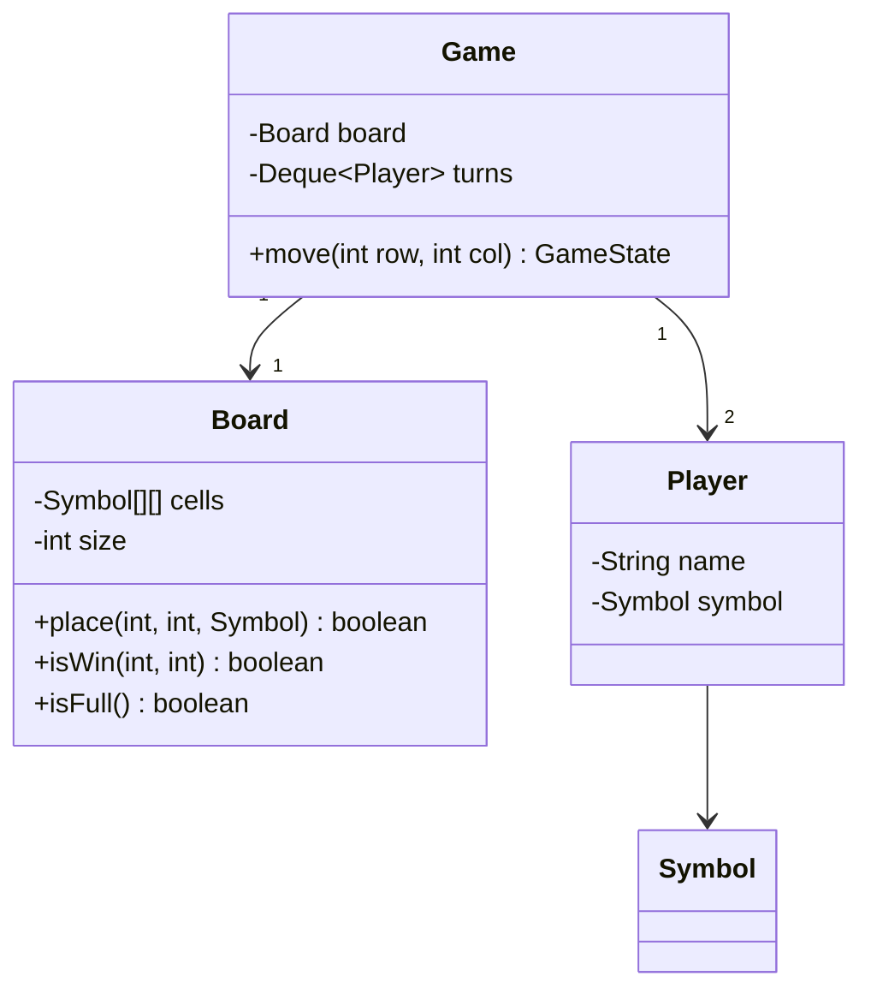

# ⭕ Design Tic-Tac-Toe

> A small, complete game model — perfect for demonstrating clean OOP and an O(1) win check on a bounded problem.

---

## 🎯 The Problem

Model a **Tic-Tac-Toe** game (generalizable to N×N): two players alternate placing marks, and after each move the system checks for a win (a full row, column, or diagonal) or a draw. It's a great warm-up that rewards clean class boundaries and a clever win-detection trick.

---

## 📝 Requirements

- An N×N board (default 3×3) and two players.
- Players alternate turns placing their symbol.
- Detect a win (row/column/diagonal) or a draw after each move.
- Reject invalid moves (occupied or out-of-bounds cells).

---

## 🧭 Design Approach

- Keep game rules in a `Game` coordinator; the `Board` only knows about cells.
- **Key optimization:** instead of scanning the whole board after every move, keep running **tallies** per row, column, and the two diagonals. When any tally hits ±N, that line is a win — an **O(1) check** per move.
- Use a queue to rotate turns between players.

---

## 🧱 Class Diagram



---

## 💻 Core Code

```java
enum Symbol { X, O, EMPTY }
enum GameState { IN_PROGRESS, WIN, DRAW }

record Player(String name, Symbol symbol) {}

class Board {
    private final int size;
    private final Symbol[][] cells;
    // running tallies: +1 for X, -1 for O
    private final int[] rows, cols;
    private int diag, anti;

    Board(int size) {
        this.size = size;
        cells = new Symbol[size][size];
        for (Symbol[] r : cells) Arrays.fill(r, Symbol.EMPTY);
        rows = new int[size];
        cols = new int[size];
    }

    boolean place(int r, int c, Symbol s) {
        if (r < 0 || c < 0 || r >= size || c >= size || cells[r][c] != Symbol.EMPTY)
            return false;
        cells[r][c] = s;
        int v = (s == Symbol.X) ? 1 : -1;
        rows[r] += v;
        cols[c] += v;
        if (r == c) diag += v;
        if (r + c == size - 1) anti += v;
        return true;
    }

    // O(1): a full line's tally has magnitude == size
    boolean isWin(int r, int c) {
        return Math.abs(rows[r]) == size || Math.abs(cols[c]) == size
            || Math.abs(diag) == size || Math.abs(anti) == size;
    }

    boolean isFull() {
        for (Symbol[] row : cells)
            for (Symbol s : row) if (s == Symbol.EMPTY) return false;
        return true;
    }
}

class Game {
    private final Board board;
    private final Deque<Player> turns = new ArrayDeque<>();

    Game(int size, Player p1, Player p2) {
        board = new Board(size);
        turns.add(p1);
        turns.add(p2);
    }

    GameState move(int r, int c) {
        Player current = turns.peekFirst();
        if (!board.place(r, c, current.symbol()))
            throw new IllegalArgumentException("Invalid move");
        if (board.isWin(r, c)) return GameState.WIN;
        if (board.isFull()) return GameState.DRAW;
        turns.addLast(turns.removeFirst()); // rotate turn
        return GameState.IN_PROGRESS;
    }
}
```

---

## ⚖️ Design Decisions

**O(1) win check** — X adds +1 and O adds −1 to the tallies for the affected row, column, and diagonals. A line is fully one player's exactly when its tally reaches +N or −N. No board scanning needed.

**Separation of concerns** — `Board` manages cells and win detection; `Game` manages turns and rules. This makes each class small and testable.

---

## ✅ Rules, invariants & scope

Clarify variants first: board size `N`, winning length `K`, number of players, local vs online play, and whether undo/timers/AI are required. The sample optimizes the common `K = N`, two-player case.

- A cell changes from `EMPTY` to one symbol exactly once.
- Only the current player may make a move while state is `IN_PROGRESS`.
- Every accepted move increments `moveCount` once and produces one immutable event.
- Terminal state (`WIN` or `DRAW`) never returns to in-progress.
- Two players must have distinct non-empty symbols.

These invariants belong in constructors and the `Game.move` boundary, not only in UI code.

---

## 🧩 Better responsibility boundaries

| Type | Responsibility |
| --- | --- |
| `Game` | Turn order, lifecycle, accepted-move history, winner |
| `Board` | Cell occupancy and bounds; no knowledge of network/UI |
| `WinningStrategy` | Decide whether the last move wins |
| `Player` | Immutable identity/symbol; human or AI behavior is separate |
| `Move` | Immutable player, coordinate, turn number, timestamp |
| `GameRepository` | Optional persistence/versioning for online play |

Extract `WinningStrategy`: `FullLineCounterStrategy` gives O(1) checks for two-player `K=N`; `DirectionalScanStrategy` checks four axes in O(K) for Gomoku/arbitrary `K`; a bitboard can optimize fixed 3×3. Strategy is useful because rules genuinely change the algorithm.

---

## 🔄 Move sequence and error contract

1. Load/create game and authenticate actor if online.
2. Validate `expectedVersion`, game state, current player, bounds, and empty cell.
3. Place symbol and update winning strategy atomically.
4. Append `Move(turnNumber, playerId, row, col)`.
5. Set `WIN`, `DRAW`, or rotate current player; increment version.
6. Return a snapshot plus the accepted move. Retries with the same `moveId` return the original result.

Use domain-specific failures: `NOT_YOUR_TURN`, `CELL_OCCUPIED`, `OUT_OF_BOUNDS`, `GAME_FINISHED`, and `STALE_VERSION`. This lets UI/API map errors cleanly without parsing exception text.

---

## 🔒 Concurrency and online persistence

For a local game, one UI event loop is enough. For an online game across servers, use optimistic concurrency:

```sql
UPDATE game
SET snapshot = :newSnapshot, version = version + 1
WHERE game_id = :id AND version = :expectedVersion AND state = 'IN_PROGRESS';
```

Only one simultaneous move updates a version. Persist the move and snapshot in the same transaction, with unique `(game_id, turn_number)` and `(game_id, move_id)` constraints. Broadcast the committed event afterwards through an outbox/WebSocket. Never let the socket message become the source of truth.

If event sourcing is used, replay moves through the same validation logic and periodically snapshot. It is educational here, but a relational snapshot is simpler for a tiny game.

---

## 🧪 Complete test set

- Constructor rejects invalid `N`, `K`, player count, or duplicate symbols.
- Every edge/corner/center move; occupied and out-of-range cells.
- Each row, column, main/anti diagonal win for both symbols.
- Draw on final move and win on final move (win must take precedence).
- No moves accepted after terminal state.
- Retry same `moveId` is stable; two concurrent same-version moves yield one success.
- Property test: `moveCount == occupiedCells`, at most one winner, symbols alternate, terminal state is absorbing.
- For `K < N`, wins in middle of a row and across both diagonal directions.

Inject or omit time; do not make core correctness depend on wall-clock time. AI tests use deterministic board positions and a bounded search budget.

---

## 🌱 Extensions & trade-offs

- AI fits behind `MoveStrategy`, receiving an immutable board view; Minimax works for 3×3, while larger games need pruning/heuristics.
- Spectators subscribe read-only; authorization distinguishes players from viewers.
- Undo is a new state transition requiring opponent consent and history rollback; it cannot be safely added as “clear cell.”
- For arbitrary symbols/players, signed row counters no longer work; use per-player counters or directional scanning.

### Interview walkthrough

“I define move/turn/terminal invariants, keep `Board` focused on cells, and let `Game` own lifecycle. A pluggable winning strategy uses O(1) counters for two-player full-line rules or O(K) directional scans for arbitrary K. Online moves use idempotent move IDs and optimistic versioning, then broadcast only after commit.”

### Further reading

- [Java collections framework](https://docs.oracle.com/en/java/javase/21/docs/api/java.base/java/util/doc-files/coll-overview.html)
- [PostgreSQL transaction isolation](https://www.postgresql.org/docs/current/transaction-iso.html)

---

## ❓ FAQs

### How do you check for a win in O(1) instead of scanning the board?
Keep a running sum for each row, column, and both diagonals — +1 for X, −1 for O. After a move, only those lines change, and any line whose sum reaches ±N is a complete win. No full-board scan is required.

### How would you extend this to a large N-in-a-row board (like Gomoku)?
Full-line sums no longer work when a win is only *k* in a row on a big board. Instead, count consecutive same-symbol cells outward from the last move in each direction and check if any run reaches *k*.

### Where would an AI opponent fit into this design?
Behind the `Player` abstraction. A `MinimaxPlayer` (or Monte Carlo) would compute the best cell for its symbol and return it, with no changes to the `Board` or `Game`.

### Why separate the Board and Game classes?
Single Responsibility — `Board` owns cell state and win detection, while `Game` owns turn order and rules. Keeping them apart makes each independently testable and easier to change.
