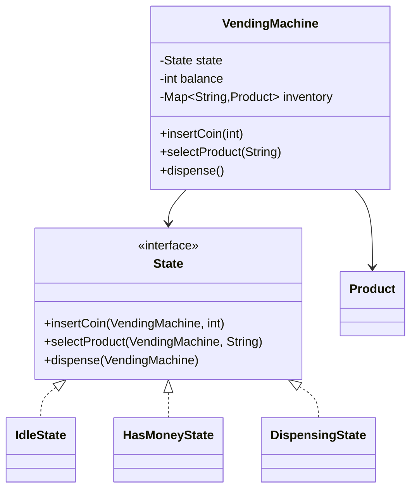

# 🥤 Design a Vending Machine

> The textbook **State pattern** problem — model coins, product selection, dispensing, and change.

---

## 🎯 The Problem

A **vending machine** behaves differently depending on what's happening: before you insert money, selecting a product should be refused; after paying, it should dispense. Modeling this with a pile of `if/else` flags gets messy fast. The clean solution is the **State pattern**, where each state object knows exactly how to handle each action.

---

## 📝 Requirements

- Insert coins/notes, select a product, dispense it, return change.
- Handle error cases: insufficient money, out of stock, cancel & refund.
- The machine's response to an action depends on its current state.

---

## 🧭 Design Approach

- **State pattern** — model `Idle`, `HasMoney`, and `Dispensing` as state objects. Each defines what `insertCoin`, `selectProduct`, and `dispense` do.
- The `VendingMachine` holds the current state and delegates every action to it, so there's no giant conditional.
- Inventory is tracked per product; balance accumulates as coins go in.

---

## 🧱 Class Diagram



---

## 💻 Core Code

```java
record Product(String code, String name, int price, int stock) {}

interface State {
    void insertCoin(VendingMachine m, int amount);
    void selectProduct(VendingMachine m, String code);
    void dispense(VendingMachine m);
}

class VendingMachine {
    final State idle = new IdleState();
    final State hasMoney = new HasMoneyState();
    final State dispensing = new DispensingState();
    private State state = idle;

    int balance = 0;
    String selected;
    final Map<String, Product> inventory = new HashMap<>();

    void setState(State s) { this.state = s; }
    void insertCoin(int amt)    { state.insertCoin(this, amt); }
    void selectProduct(String c){ state.selectProduct(this, c); }
    void dispense()             { state.dispense(this); }
}

class IdleState implements State {
    public void insertCoin(VendingMachine m, int amt) {
        m.balance += amt;
        m.setState(m.hasMoney);
    }
    public void selectProduct(VendingMachine m, String c) {
        throw new IllegalStateException("Insert money first");
    }
    public void dispense(VendingMachine m) {
        throw new IllegalStateException("No product selected");
    }
}

class HasMoneyState implements State {
    public void insertCoin(VendingMachine m, int amt) { m.balance += amt; }
    public void selectProduct(VendingMachine m, String code) {
        Product p = m.inventory.get(code);
        if (p == null || p.stock() == 0) throw new IllegalStateException("Out of stock");
        if (m.balance < p.price())       throw new IllegalStateException("Insufficient balance");
        m.selected = code;
        m.setState(m.dispensing);
    }
    public void dispense(VendingMachine m) {
        throw new IllegalStateException("Select a product first");
    }
}

class DispensingState implements State {
    public void insertCoin(VendingMachine m, int amt) {
        throw new IllegalStateException("Dispensing in progress");
    }
    public void selectProduct(VendingMachine m, String c) {
        throw new IllegalStateException("Dispensing in progress");
    }
    public void dispense(VendingMachine m) {
        Product p = m.inventory.get(m.selected);
        int change = m.balance - p.price();
        m.inventory.put(p.code(), new Product(p.code(), p.name(), p.price(), p.stock() - 1));
        m.balance = 0;
        m.selected = null;
        m.setState(m.idle);
        System.out.println("Dispensed " + p.name() + ", change: " + change);
    }
}
```

---

## ⚖️ Design Decisions

**Why State over flags?** Each state encapsulates its own behavior, so the `VendingMachine` has no sprawling conditionals. Adding a new state (e.g., `OutOfService`) is a new class, not edits scattered across methods.

**Transitions are explicit** — each state decides what the next state is (`Idle → HasMoney → Dispensing → Idle`), making the flow easy to follow and hard to break.

---

## ✅ Invariants and complete state model

- Accepted credit equals the exact sum of retained payment units.
- Inventory quantity and cash/change inventory never become negative.
- One transaction dispenses at most one selected product and one change result.
- Product stock is decremented only when dispensing succeeds (or is moved to a recoverable `DISPENSE_FAILED` state).
- Cancellation returns exactly the refundable inserted credit.
- Hardware fault/out-of-service overrides purchase actions.

The minimal three states teach the pattern, but an end-to-end model benefits from:

```text
IDLE → CREDIT_AVAILABLE → PRODUCT_RESERVED → DISPENSING → RETURNING_CHANGE → IDLE
                        └→ CANCELLED ───────────────────────────────→ IDLE
ANY ──hardware/admin fault──→ OUT_OF_SERVICE
```

Separate the durable/physical facts (`credit`, `inventory`, `coin inventory`, `selected product`) from the State objects that decide which command is legal.

---

## 🧩 Components and ports

| Type | Responsibility |
| --- | --- |
| `VendingMachine` | Serialized transaction context and state delegation |
| `MachineState` | Legal commands/transitions for current lifecycle |
| `Inventory` | Product slots, price/version, quantity reservation/commit/release |
| `CashBox` | Accepted denominations and available change |
| `ChangeStrategy` | Exact-change combination from available denominations |
| `DispenserPort` | Command product motor and report sensor result |
| `PaymentPort` | Optional card/mobile authorization/capture/refund |
| `AuditLog` | Append sale, refund, restock, fault, cash reconciliation events |

Use integer minor units (`int/long`) for one currency. Define an allow-list of denominations; reject arbitrary positive integers. A `Product` record should not carry mutable stock—slot/inventory owns quantity.

---

## 🔄 Purchase lifecycle

1. Start a transaction ID on first accepted coin/card interaction.
2. Validate denomination and atomically add credit/cash inventory, or authorize an external payment without capturing yet.
3. On selection, load slot and current price, check stock, and compute whether exact change is possible **before** committing sale.
4. Reserve one unit and transition to `PRODUCT_RESERVED`.
5. Command dispenser with `(transactionId, slot)`; wait for bounded sensor acknowledgement.
6. On success, commit stock decrement/payment capture and return the precomputed change units.
7. Verify change actuators, close transaction, append audit event, and return to `IDLE`.
8. On cancel before dispense, release reservation and refund inserted credit/void authorization.

A failure after the product physically drops but before software records it is an unknown outcome. Reconcile using dispenser sensors/audit sequence and do not automatically dispense again.

---

## 🪙 Exact change with limited inventory

Greedy works for many canonical denominations but not all inventories/currencies. Use bounded dynamic programming/backtracking to find a combination that sums to `change` without exceeding coin counts. Optimize for fewest coins or operational preference.

```text
findChange(amount, denominations, counts) -> Map<Denomination, quantity> | NONE
```

Compute a plan on a snapshot, then reserve those coins with the product in the same critical section. If exact change is unavailable, reject selection without consuming credit. Reconcile reserved/dispensed coin counts through sensors and cash audits.

---

## 🔒 Concurrency and hardware failures

A physical front panel normally serves one purchase: process all commands through one event loop and attach `transactionId` so delayed button/sensor events from an old transaction are ignored. Restock/admin operations acquire a service-mode lease and cannot race with a sale.

| Failure | Recovery |
| --- | --- |
| Product jam/no drop sensor | Keep `DISPENSE_FAILED`, refund/void by policy, mark slot unavailable |
| Change actuator partial failure | Record planned vs sensed output, stop service, operator reconciliation |
| Power loss | Recover transaction/audit snapshot; reconcile physical cash/stock before accepting sales |
| Card provider timeout | Query by idempotency key; do not submit a new charge blindly |
| Price changes during credit | Apply stated policy: pin at selection or require confirmation |

---

## 🧪 Test matrix

- Every legal/illegal command in every state; terminal/fault transitions.
- Accepted/rejected denomination and cancel refund total.
- Exact change, alternate combination, impossible change, depleted coin type.
- Last product, out of stock, price exactly/under/over balance.
- Product jam before/after drop sensor, change partial dispense, power recovery.
- Duplicate button/sensor/payment callback with same transaction ID.
- Invariant/property tests: no negative stock/cash, `inserted = price + returned + retained/refunded`.

Inject fake clock, dispenser, sensors, payment, and deterministic `ChangeStrategy`. Tests should not print to console or sleep.

---

## 🌱 Extensions and interview summary

Promotions are a pricing strategy; multiple product purchase changes the reservation aggregate; telemetry/restock is an admin application service; card/mobile payment introduces authorization/capture/refund states but reuses the same transaction boundary.

“I use a serialized state machine so commands are legal only in the right phase. Inventory and limited change are reserved before hardware action. Dispense/payment commands use stable transaction IDs, sensor outcomes are explicit—including unknown/partial failure—and an append-only audit trail supports recovery and cash/stock reconciliation.”

### Further reading

- [Java concurrency utilities](https://docs.oracle.com/en/java/javase/21/core/concurrency.html)
- [Java `BigDecimal` when decimal currency precision is required](https://docs.oracle.com/en/java/javase/21/docs/api/java.base/java/math/BigDecimal.html)

---

## ❓ FAQs

### Why is the State pattern the right choice here?
Because the same action behaves differently depending on the machine's condition — selecting a product before paying must be rejected, but allowed after. Each state class encapsulates that behavior, eliminating a tangle of boolean flags and if/else in the machine.

### How would you make correct change with limited coins?
Track the machine's coin inventory and run a greedy or dynamic-programming change-making algorithm. If exact change can't be made, refuse the sale or ask for exact payment.

### How do you handle concurrency (two people using it)?
A physical machine serves one user at a time, so you serialize a transaction — lock the machine (or the balance/inventory updates) for the duration of a single purchase.

### How do you add a new state like "out of service" later?
Create a new `State` implementation and transition to it when needed. Because behavior lives in state classes, you don't modify existing states — an example of the Open/Closed principle.
